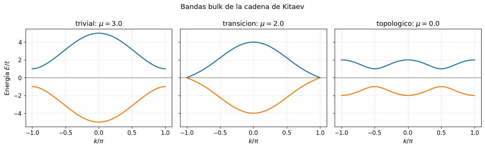
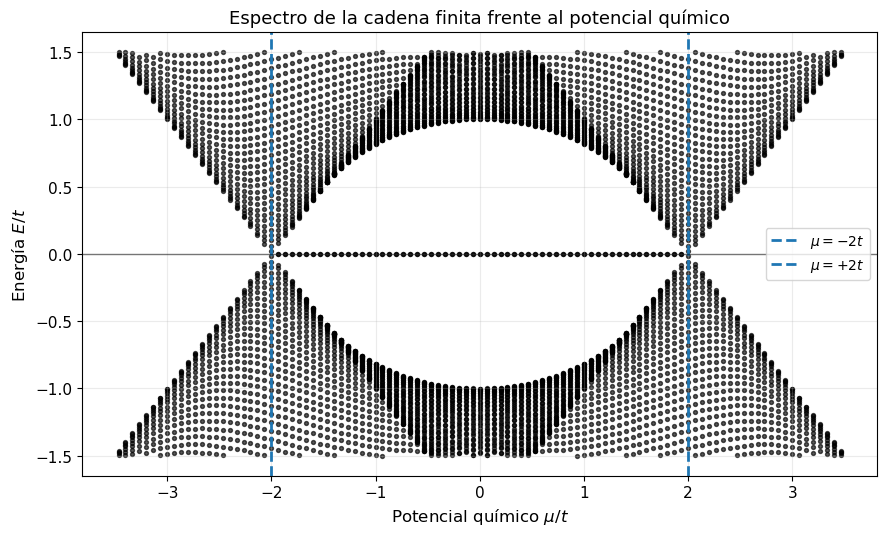
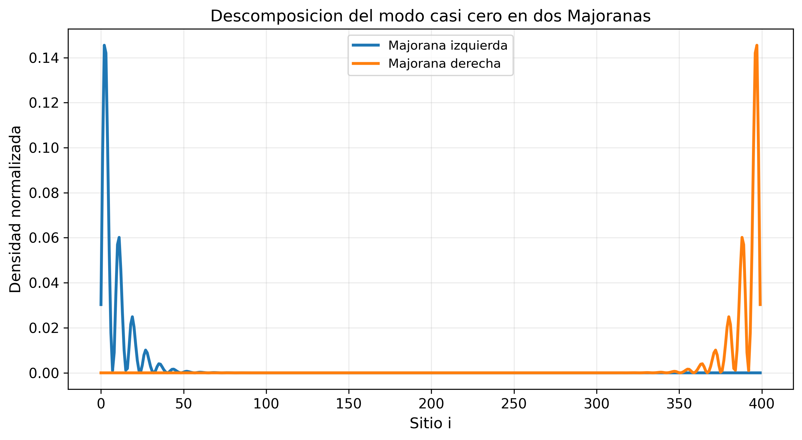

# Majorana Zero Modes in 1D Superconducting Systems

Numerical exploration of Majorana zero modes in three increasingly realistic one-dimensional Bogoliubov--de Gennes (BdG) models:

1. the spinless Kitaev chain,
2. a spinful self-consistent BdG nanowire,
3. a proximitized Rashba nanowire with Zeeman field, induced superconductivity, smooth interfaces, and electrostatic barriers.

The project is designed as a compact research-style simulation notebook in code form: it starts from the minimal topological model, adds self-consistent superconducting order, and ends with a semiconductor-superconductor nanowire model closer to the devices used in Majorana experiments.

## Main idea

A Majorana zero mode is not identified by a single visual signature. In a finite numerical wire, a state close to zero energy can also be produced by ordinary Andreev physics, smooth confinement, or finite-size effects. For that reason this project combines multiple diagnostics:

- bulk band closing and reopening,
- finite-chain spectra versus chemical potential and Zeeman energy,
- local density of states,
- localization of low-energy states at the two ends,
- particle-hole balance,
- Majorana-component decomposition,
- finite-size energy splitting,
- response to Rashba coupling, induced gap, barrier strength, mesh resolution, and interaction strength.

The result is a progression from a clean textbook topological superconductor to a more realistic nanowire where zero-bias-like low-energy states must be interpreted carefully.

## Repository contents

This ZIP is intentionally flat so it can be uploaded directly through the GitHub web interface. After upload, ask GitHub Copilot to organize it into folders such as `src/`, `docs/`, and `assets/figures/` using the prompt included below.

Core files:

| File | Purpose |
|---|---|
| `README.md` | Main repository landing page. |
| `theory_and_history.md` | Full theoretical background: BdG, Kitaev model, self-consistency, and proximitized nanowires. |
| `results_and_discussion.md` | Figure-by-figure interpretation of the numerical results. |
| `implementation_notes.md` | Code architecture, numerical methods, observables, and reproducibility notes. |
| `ASSETS_INDEX.md` | Complete list of selected figures and why each one is included. |
| `kitaev_chain_1d.py` | Spinless Kitaev-chain model. |
| `self_consistent_bdg_nanowire.py` | Self-consistent spinful BdG nanowire model. |
| `proximitized_bdg_nanowire.py` | Proximitized Rashba nanowire model. |
| `requirements.txt` | Python dependencies. |

## Selected visual highlights

### Kitaev chain: the minimal topological superconductor






### Self-consistent BdG model




### Proximitized nanowire model


### Quasi-Majorana / smooth-potential cautionary case


## Quick start

Install the dependencies:

```bash
python -m venv .venv
source .venv/bin/activate  # Windows: .venv\Scripts\activate
pip install -r requirements.txt
```

Run one of the scripts:

```bash
python kitaev_chain_1d.py
python self_consistent_bdg_nanowire.py
python proximitized_bdg_nanowire.py
```

The scripts use dense matrix diagonalization for clarity. Dense BdG simulations scale quickly with the number of lattice sites. The versions included here use demo-safe site counts; increase them only when generating final figures and only if your machine has enough memory.

## Suggested final folder structure

After upload, the repository should ideally be reorganized as:

```text
.
├── README.md
├── requirements.txt
├── src/
│   ├── kitaev_chain_1d.py
│   ├── self_consistent_bdg_nanowire.py
│   └── proximitized_bdg_nanowire.py
├── docs/
│   ├── theory_and_history.md
│   ├── results_and_discussion.md
│   └── implementation_notes.md
└── assets/
    ├── ASSETS_INDEX.md
    └── figures/
        ├── kitaev/
        ├── self_consistent/
        ├── realistic_nanowire/
        └── quasi_majoranas/
```

## Scientific scope

The goal is not to claim experimental discovery of Majorana modes. The goal is to build a physically transparent simulation pipeline showing how Majorana-like signatures emerge, how they are diagnosed, and why a careful comparison between bulk topology and finite-device observables is necessary.
