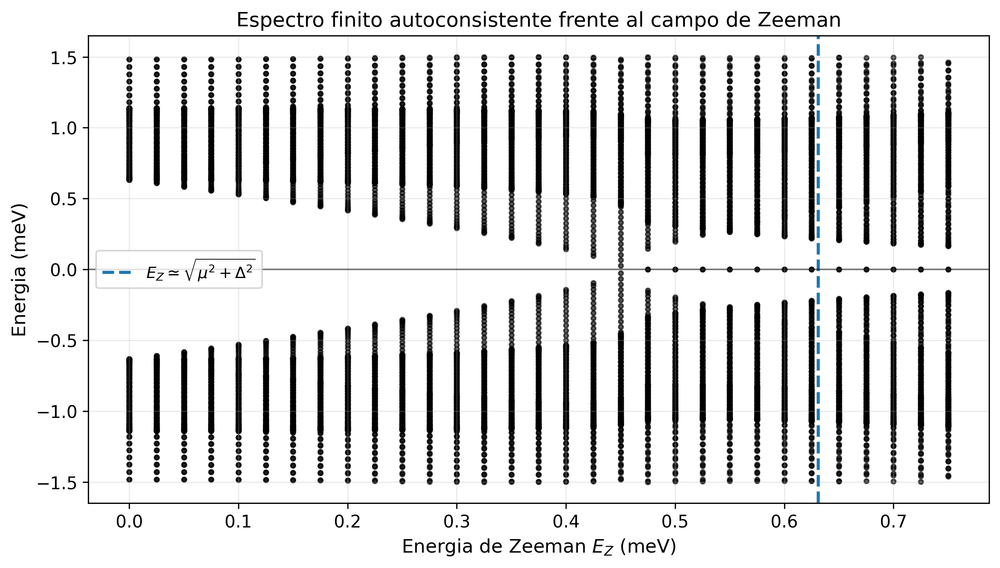
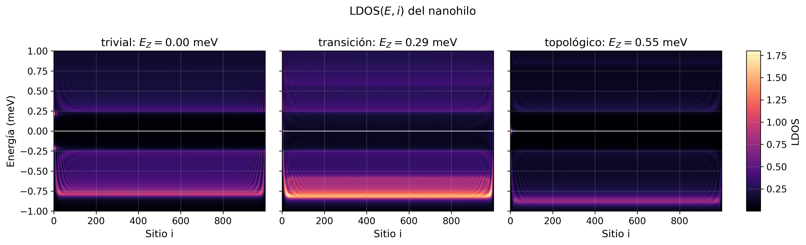
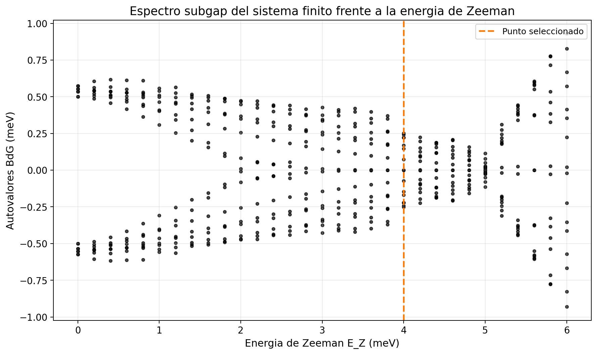

# Majorana Zero-Mode Diagnostics in 1D BdG Nanowire Simulations

Research-style Python simulations of Majorana zero modes in one-dimensional superconducting systems, spanning the minimal Kitaev chain, a self-consistent BdG nanowire, and a proximitized Rashba nanowire with finite-device diagnostics.

This repository is organized as a compact computational physics portfolio project: it moves from an analytically transparent toy model to more realistic finite-device simulations, while keeping the scientific interpretation cautious. Near-zero-energy states are treated as candidates that require multiple consistency checks rather than as automatic proof of topological Majorana zero modes.

## Table of contents

- [Project overview](#project-overview)
- [Theory and background](#theory-and-background)
- [Numerical models](#numerical-models)
- [Results and selected figures](#results-and-selected-figures)
- [How to run](#how-to-run)
- [Repository structure](#repository-structure)
- [Scientific interpretation](#scientific-interpretation)
- [Future improvements](#future-improvements)

## Project overview

The project studies low-energy states in one-dimensional superconducting systems using the Bogoliubov--de Gennes formalism. The workflow is deliberately staged:

1. **Kitaev chain** for the clean topological benchmark.
2. **Self-consistent BdG nanowire** for order-parameter feedback and gap suppression.
3. **Proximitized Rashba nanowire** for a more device-oriented finite-wire model with smooth interfaces and electrostatic barriers.

Across these models, the repository compares bulk topology, finite-size spectra, local density of states, localization, particle-hole balance, Majorana decomposition, and finite-length splitting. The aim is not to overstate Majorana identification, but to show how different diagnostics support or weaken a topological interpretation.

## Theory and background

The long-form theoretical discussion, historical context, and governing equations are preserved in:

- [Theory and historical background](docs/theory_and_history.md)
- [Implementation notes](docs/implementation_notes.md)
- [Results and discussion](docs/results_and_discussion.md)

These documents cover the BdG formalism, the Kitaev-chain phase boundary, self-consistent pairing, proximitized nanowires, and the limitations of interpreting near-zero modes in finite inhomogeneous systems.

## Numerical models

### `src/kitaev_chain_1d.py`
Spinless Kitaev-chain simulation used as the minimal topological reference. It computes bulk bands, finite-chain spectra, LDOS, particle-hole content, Majorana decomposition, splitting versus length, and the ideal phase diagram.

### `src/self_consistent_bdg_nanowire.py`
Spinful one-dimensional BdG nanowire with Rashba coupling, Zeeman field, and a pairing profile updated self-consistently from the eigenvectors. It highlights how superconducting order evolves with the same parameters that drive topological transitions.

### `src/proximitized_bdg_nanowire.py`
More realistic proximitized Rashba nanowire with an induced gap profile, smooth superconducting coverage, and electrostatic barriers. It is the main finite-device model for comparing topological and quasi-Majorana-like signatures.

## Results and selected figures

A full figure-by-figure discussion is available in [docs/results_and_discussion.md](docs/results_and_discussion.md). The complete curated asset list is in [assets/ASSETS_INDEX.md](assets/ASSETS_INDEX.md).

### Kitaev-chain benchmark


The bulk spectrum reproduces the expected gap closing and reopening associated with the ideal topological transition.

### Self-consistent BdG nanowire



The self-consistent model shows that spectral evolution and pairing evolution are coupled; the gap is not a passive fixed input.

### Proximitized finite nanowire



The proximitized wire resolves how end-localized low-energy weight develops in a finite device, but also why LDOS signatures alone are not decisive.

### Quasi-Majorana cautionary case



Smooth confinement can generate near-zero-energy states that mimic some Majorana-like observables without establishing a robust topological phase.

## How to run

Install the dependencies with `requirements.txt`:

```bash
python -m venv .venv
source .venv/bin/activate  # Windows: .venv\Scripts\activate
pip install -r requirements.txt
```

Run any model from the repository root:

```bash
python src/kitaev_chain_1d.py
python src/self_consistent_bdg_nanowire.py
python src/proximitized_bdg_nanowire.py
```

Quick verification:

```bash
python -m py_compile src/*.py
```

The simulations use dense matrix diagonalization for transparency, so runtime and memory grow quickly with system size. The default site counts are chosen to be demo-friendly rather than production-scale.

## Repository structure

```text
.
├── README.md
├── requirements.txt
├── .gitignore
├── src/
│   ├── kitaev_chain_1d.py
│   ├── self_consistent_bdg_nanowire.py
│   └── proximitized_bdg_nanowire.py
├── docs/
│   ├── theory_and_history.md
│   ├── results_and_discussion.md
│   └── implementation_notes.md
└── assets/
    ├── ASSETS_INDEX.md
    └── figures/
        ├── kitaev/
        ├── self_consistent/
        ├── realistic_nanowire/
        └── quasi_majoranas/
```

## Scientific interpretation

A near-zero-energy mode in a finite superconducting wire is **not** automatically evidence of a topological Majorana zero mode. Similar low-energy features can arise from finite-size splitting, smooth confinement, partially separated Andreev bound states, or other inhomogeneous device effects.

For that reason, this repository emphasizes a multi-observable interpretation: bulk-gap behavior, finite-size spectra, localization, particle-hole balance, BdG charge, spin diagnostics, and Majorana decomposition should be considered together. The project is meant as a technically serious simulation study, not as a claim of experimental discovery.
