# Results and Discussion

This document explains the figures selected for the GitHub repository. The results are organized in the same conceptual order as the code: first the Kitaev chain, then the self-consistent BdG nanowire, then the proximitized realistic nanowire, and finally a quasi-Majorana/smooth-potential cautionary case.

The central message is that a near-zero eigenvalue is not enough. Majorana identification requires consistency between bulk topology, finite-size spectra, spatial localization, particle-hole structure, and robustness under parameter changes.

---

## 1. Kitaev chain results

### 1.1 Bulk bands and the topological transition

The bulk-band plot shows the three canonical regimes of the Kitaev chain: trivial, critical, and topological. The analytical dispersion is

$$
E(k)=\pm\sqrt{(-\mu-2t\cos k)^2+(2\Delta\sin k)^2}.
$$

In the trivial regime, $|\mu|>2|t|$, the system is gapped but topologically ordinary. In the critical case, the gap closes at $k=0$ or $k=\pi$. This gap closing is not just a numerical accident; it is the point where the bulk topological invariant can change. In the topological regime, $|\mu|<2|t|$, the gap reopens with a different topological character. For an open finite chain, this reopened topological bulk gap supports boundary Majorana modes.

### 1.2 Ideal phase diagram

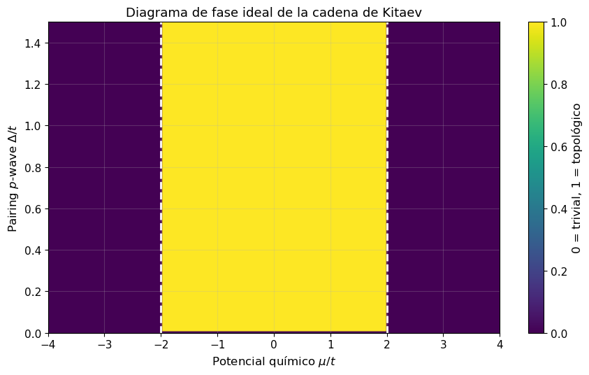

The ideal phase diagram marks the region $|\mu|<2|t|$ and $\Delta\neq0$ as topological. It is useful because it provides a clean reference against which finite-chain calculations can be checked. The vertical phase boundaries are independent of the magnitude of $\Delta$ as long as the pairing is nonzero. Increasing $\Delta$ changes the localization length and the gap scale, but it does not move the ideal Kitaev-chain transition in $\mu$.

### 1.3 Finite-chain spectrum versus chemical potential

The finite-chain spectrum shows how discrete BdG eigenvalues evolve as the chemical potential is swept. In the topological window, states approach zero energy. These are the finite-size descendants of the Majorana end modes predicted by the bulk topological phase. Because the chain is finite, the two end modes overlap weakly and therefore do not always sit exactly at zero. The near-zero level should be interpreted together with the spatial wavefunction and the length dependence.

### 1.4 Minimum absolute energy versus chemical potential

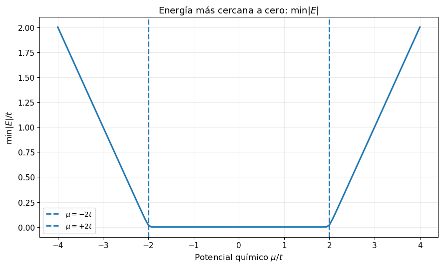

The minimum absolute energy compresses the spectrum into a single diagnostic, $\min|E|$. It highlights the parameter region where low-energy states appear. The expected result is that $\min|E|$ becomes very small in the topological phase and increases outside it. This is a useful first detector but it is deliberately not used as the only criterion. A low value of $\min|E|$ indicates a candidate low-energy state; it does not by itself prove topological protection.

### 1.5 Local density of states

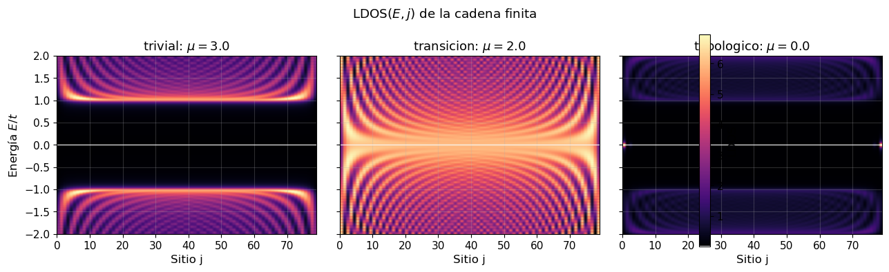

The LDOS figure shows how spectral weight is distributed in both energy and position. In the topological regime, low-energy spectral weight concentrates near the ends of the chain. In a trivial regime, low-energy end-localized spectral weight should be absent or much weaker. This plot is important because Majorana physics is spatial. The defining feature is not merely a small energy but a pair of boundary-localized components separated across the system.

### 1.6 Trivial versus topological near-zero state

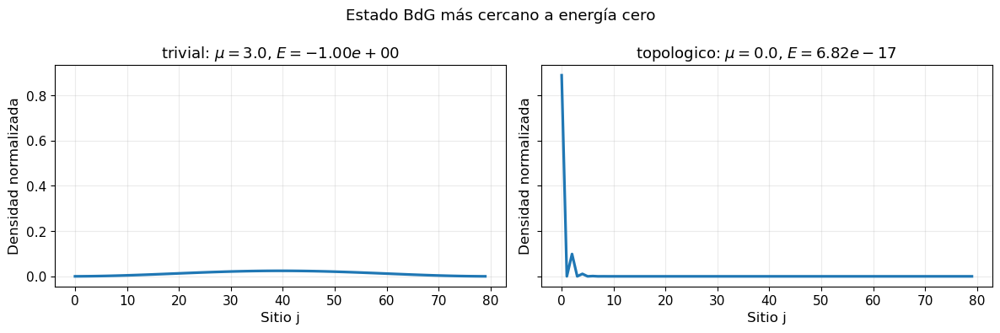

This comparison directly contrasts the density of the state closest to zero energy in trivial and topological regimes. In the topological case, the density has strong weight at both ends of the finite chain, consistent with a nonlocal fermionic state formed from two Majorana components. In the trivial case, the lowest-energy state is not a pair of protected end modes. This is one of the clearest finite-chain illustrations of bulk-boundary correspondence.

### 1.7 Majorana decomposition

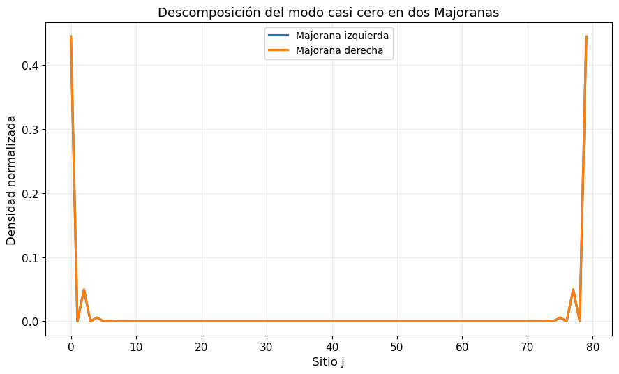

The Majorana decomposition separates the near-zero Dirac fermion into two real Majorana-like components. The expected topological signature is that one component is localized near the left edge and the other near the right edge. This is stronger than plotting the total density alone: a total density with two peaks can hide whether the underlying Majorana components are truly separated or whether both components live in the same local region.

### 1.8 Particle-hole content

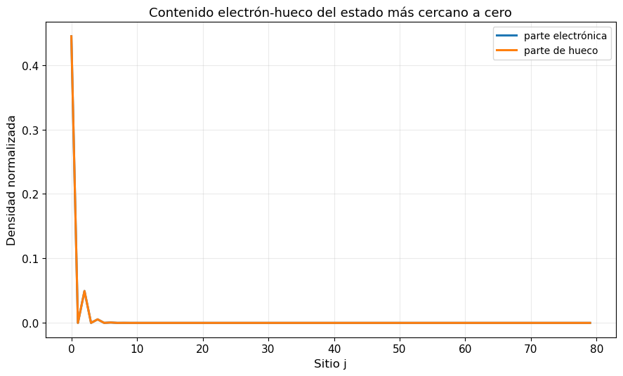

A Majorana zero mode is its own antiparticle in the BdG sense. Numerically, that means the electron and hole components should be balanced after the correct particle-hole pairing and phase alignment. The particle-hole plot checks this structure. Deviations can appear because of finite-size splitting, numerical phase conventions, or because the state is not an ideal zero mode.

### 1.9 Splitting versus length

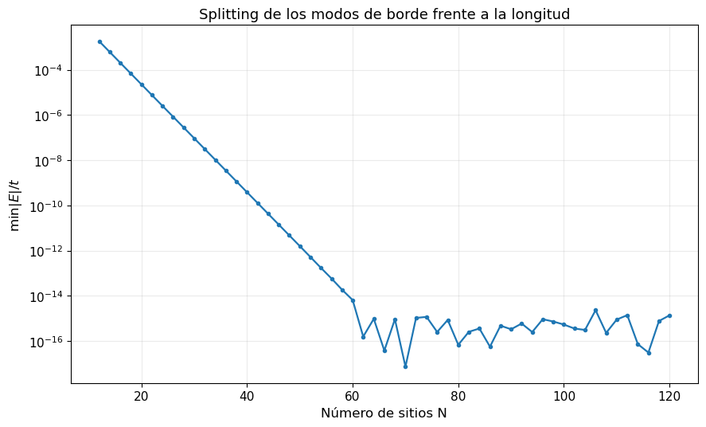

The splitting plot tests whether the near-zero energy decreases as the chain grows. In a finite topological chain, the two end Majoranas hybridize through their exponentially decaying tails. As the chain length increases, the overlap is reduced and the splitting should generally fall. Oscillations can occur because the wavefunction carries an effective Fermi wavelength. This length dependence is one of the most important checks that the near-zero level is caused by end-mode overlap rather than an arbitrary accidental degeneracy.

### 1.10 Pairing strength and localization

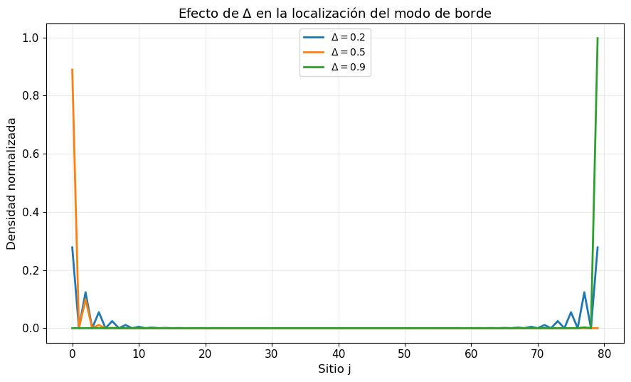

Changing the p-wave pairing modifies the coherence length of the edge modes. Stronger pairing generally produces more localized boundary modes, while weaker pairing allows the wavefunctions to extend farther into the chain. This explains why the same topological phase can look numerically more or less clean depending on the gap scale and the system length.

---

## 2. Self-consistent BdG results

### 2.1 Convergence of the order parameter

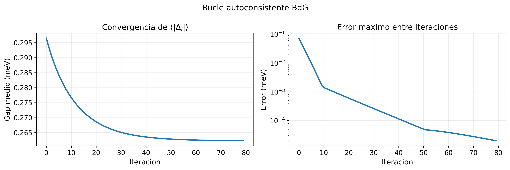

The self-consistent model begins from a seed gap and repeatedly updates $\Delta_i$ using the BdG eigenvectors. The convergence plot verifies that the iteration stabilizes. The mean gap approaches a steady value, and the maximum update error decreases. This is a required validation step: without convergence, the subsequent spectrum would correspond to an arbitrary intermediate profile rather than a self-consistent solution.

The result also demonstrates why self-consistency matters. The superconducting order parameter is not merely a visual parameter. It is tied to anomalous electron-hole correlations, and those correlations respond to Zeeman field, temperature, interaction strength, and finite-size geometry.

### 2.2 Spatial gap profile

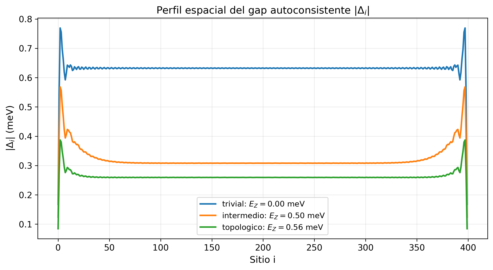

The spatial profile of $|\Delta_i|$ shows how the superconducting order varies along the finite chain. The profile is relatively uniform in the interior but can deviate near the boundaries because the finite system has open ends. As the Zeeman field increases, the gap is suppressed. This agrees with the physical competition between singlet pairing and spin polarization: singlet superconductivity correlates opposite spins, while the Zeeman field tends to align them.

### 2.3 Bulk bands with self-consistent pairing

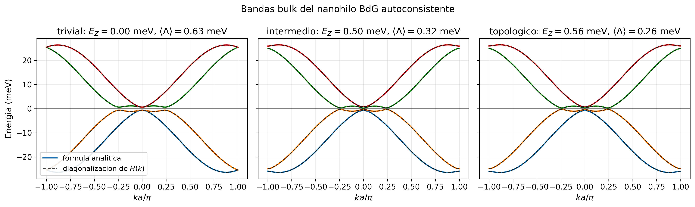

The bulk-band figure shows how the self-consistent gap enters the homogeneous band structure. Compared with a fixed-gap model, the effective superconducting scale is now determined by the converged order parameter. The bulk gap reduction with Zeeman field signals approach to a topological transition. The important point is that the bulk bands are not computed with an arbitrary external $\Delta$; they are interpreted using the order parameter obtained from the self-consistency loop.

### 2.4 Finite spectrum versus Zeeman energy

The finite spectrum shows the transition from a gapped trivial regime to a regime with low-energy subgap states. As the Zeeman energy increases, the superconducting gap is reduced and states move toward zero. In a finite open chain, the emergence of near-zero states is the boundary manifestation of the underlying topological change. However, because the system is finite and the gap is self-consistent, the visual transition is not an infinitely sharp mathematical singularity.

### 2.5 Bulk gap versus Zeeman energy

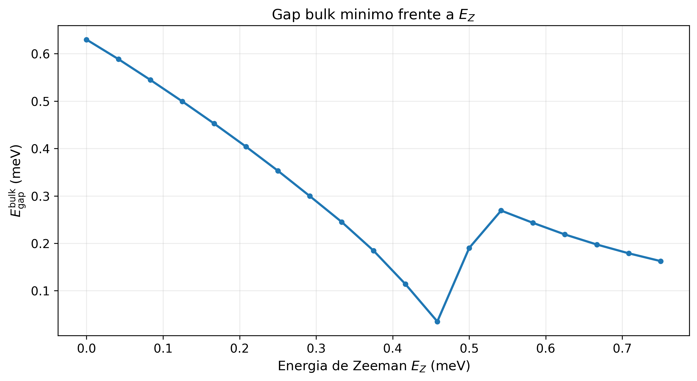

The bulk gap diagnostic is the cleanest way to track the homogeneous transition. A topological phase transition requires a bulk gap closing in the ideal infinite system. The plotted decrease of the minimum positive bulk energy indicates where the system approaches that transition. In a finite system, the edge-state spectrum should be interpreted relative to this bulk diagnostic.

### 2.6 LDOS in three regimes

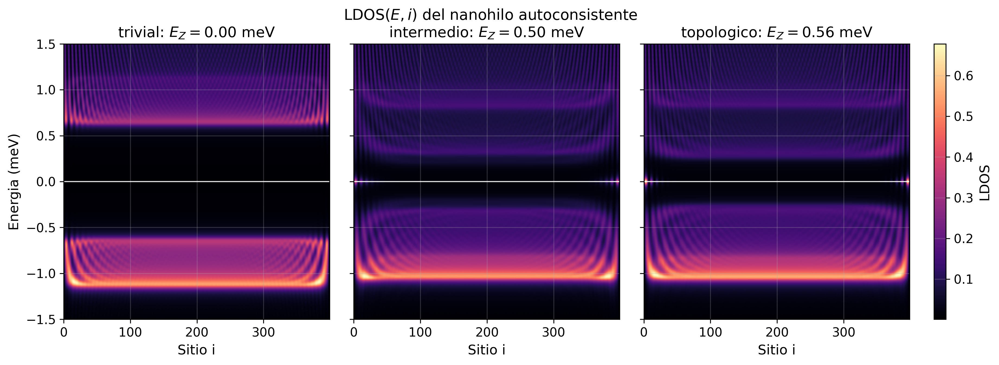

The LDOS reveals where subgap spectral weight lives. In the topological regime, low-energy weight appears near the ends. In intermediate regimes, the spectral weight can begin to move toward the gap before a clean separated Majorana pattern is fully developed. This plot connects the spectral transition to a spatial measurement: a simulated tunneling probe near the end of the wire would be sensitive to end-localized low-energy LDOS.

### 2.7 Mode comparison: trivial and topological

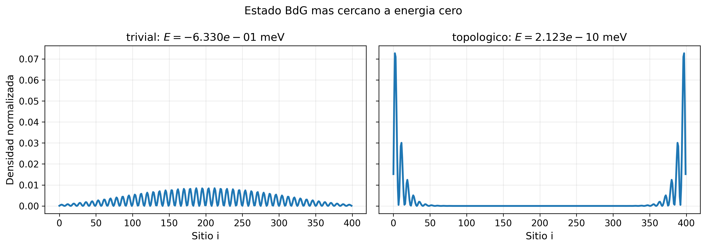

This figure compares the lowest-energy BdG state across regimes. In the topological case, the state becomes strongly edge-localized. In the trivial case, the state lacks the same robust two-edge structure. The comparison reinforces the rule that the lowest eigenvalue must be analyzed spatially. A finite spectrum alone can hide whether the state is extended, localized at one end, or split across both ends.

### 2.8 Majorana components

The self-consistent Majorana decomposition shows whether the near-zero state can be separated into two end-localized Majorana-like components. A clean topological mode should give one component near the left end and one near the right end. If both components are localized near the same end, the state is better interpreted as a partially separated Andreev state rather than a pair of topological Majoranas.

### 2.9 Particle-hole balance

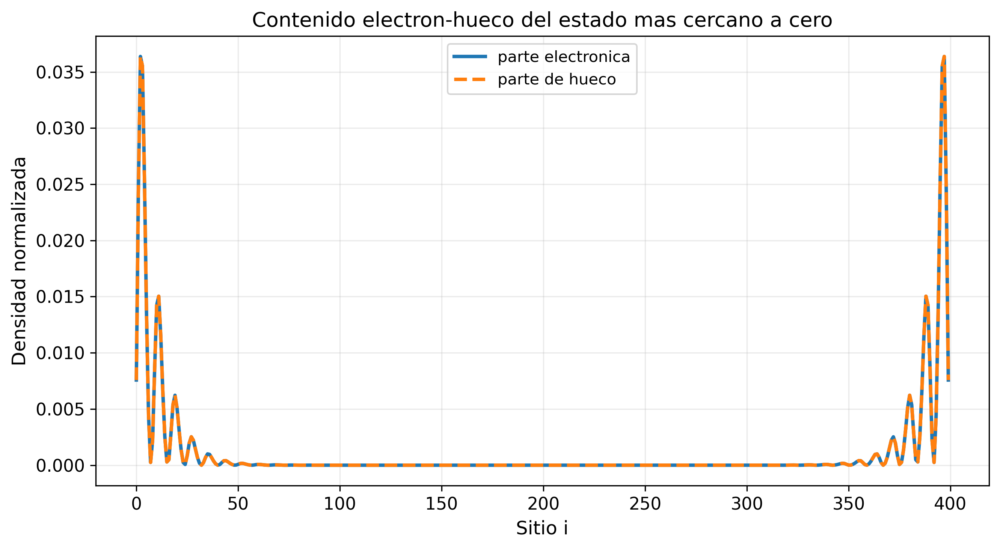

The particle-hole content checks whether the near-zero mode behaves like an equal electron-hole superposition. This is expected for an ideal Majorana state. The plot is also useful for identifying ordinary quasiparticle states, which can be more electron-like or hole-like away from zero energy.

### 2.10 Splitting versus length

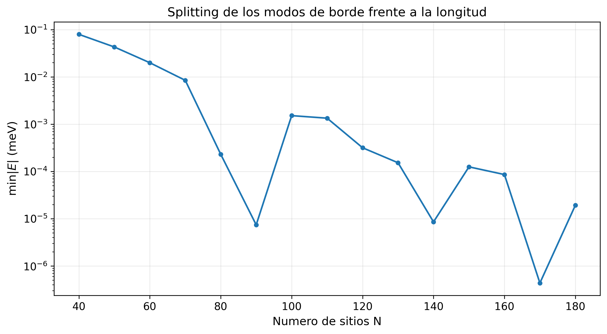

The length sweep tests finite-size hybridization in the self-consistent setting. The expected physical trend is that increasing the wire length reduces the overlap of the two Majorana components and therefore reduces the splitting. Because the gap is recalculated, the length dependence also includes changes in the self-consistent background, making the diagnostic more physically rich than in the fixed Kitaev-chain model.

### 2.11 Minimum-energy map in the chemical-potential/Zeeman plane

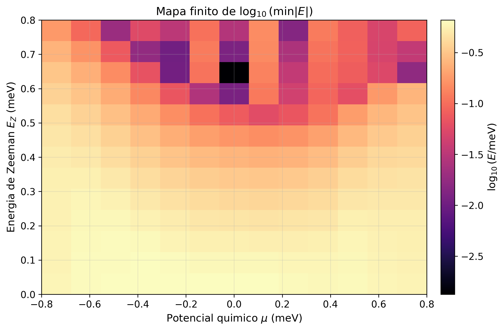

The two-dimensional map shows where low-energy states occur as both chemical potential and Zeeman energy are varied. This is useful because the topological region is not a single point: it occupies a region of parameter space. The map also helps reveal where finite-size effects or gap suppression create low-energy states near, but not necessarily identical to, the ideal bulk boundary.

### 2.12 Interaction strength and localization

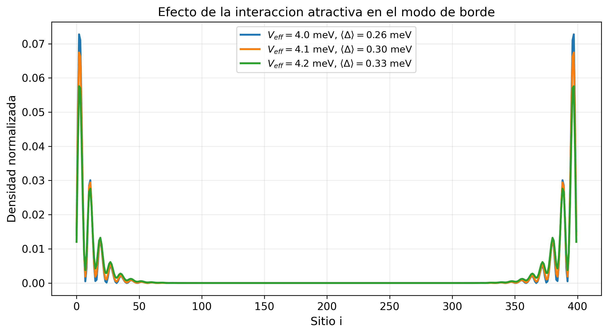

Changing the effective attractive interaction modifies the converged gap. A larger effective attraction generally supports a stronger superconducting order parameter, which influences both the bulk gap and the localization length. This figure illustrates the feedback loop: microscopic pairing strength changes $\Delta_i$, and $\Delta_i$ changes the Majorana localization properties.

### 2.13 Gap profile versus interaction

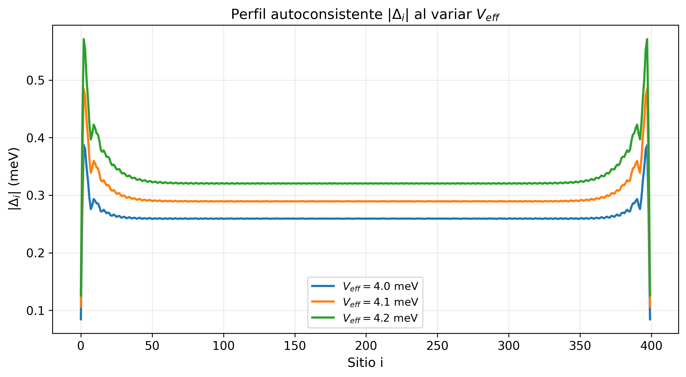

The gap-versus-interaction figure makes the previous point explicit by showing how the spatial profile of $\Delta_i$ depends on $V_{\mathrm{eff}}$. It is a useful check that the self-consistency routine reacts in the expected direction: stronger attraction produces a larger order parameter, while finite boundaries and Zeeman physics shape the final spatial profile.

---

## 3. Proximitized realistic nanowire results

### 3.1 Spatial profiles of the realistic model

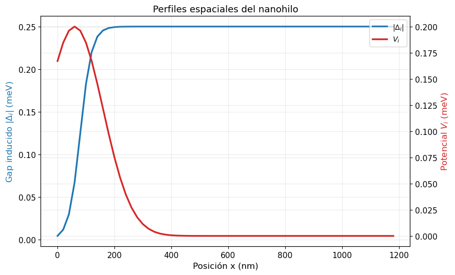

The realistic model replaces the self-consistent intrinsic gap with an induced superconducting profile and an electrostatic potential profile. This figure summarizes the device inputs: where superconductivity is present, where barriers or smooth potentials appear, and how the finite wire differs from an ideal homogeneous bulk model. This is the bridge from a mathematical BdG model to a device-inspired simulation.

### 3.2 Superconducting coverage profile

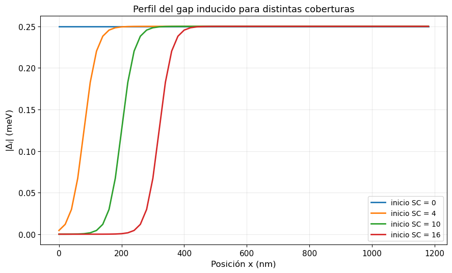

The induced gap is modeled using a smooth coverage function. This allows the simulation to represent a normal segment near the end of the wire or a gradual transition into the superconducting region. Such smoothness matters because abrupt and smooth boundaries can produce different low-energy bound-state behavior.

### 3.3 Bulk bands

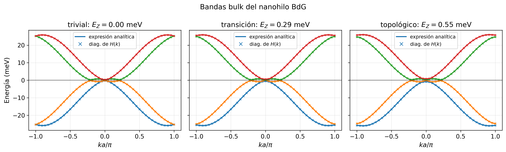

The bulk bands of the homogeneous proximitized nanowire show the spin-orbit/Zeeman/superconducting structure behind the effective topological transition. In the clean ideal model, the gap closes near $E_Z=\sqrt{\mu^2+\Delta^2}$ and reopens in a topological phase. The finite-device simulations should be interpreted relative to this bulk picture, while remembering that real-space inhomogeneity can produce additional subgap states.

### 3.4 Finite spectrum versus Zeeman energy

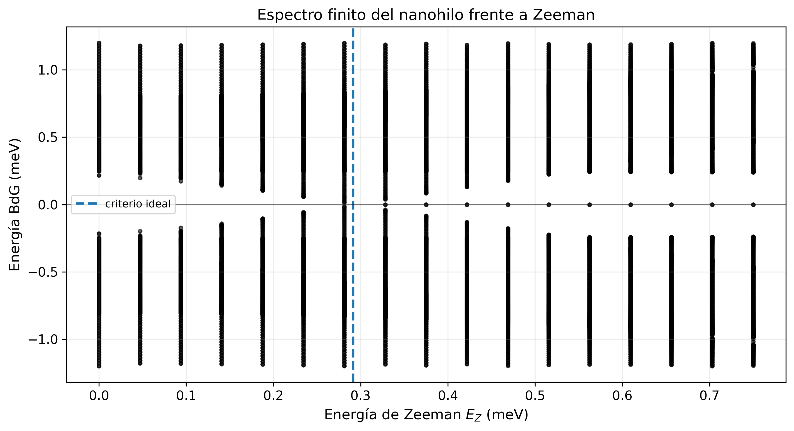

The finite spectrum displays how subgap levels move as the Zeeman energy is increased. The appearance of near-zero modes is consistent with the expected topological regime, but finite wires can contain many avoided crossings and low-energy states. The spectrum is therefore a starting point, not the final conclusion.

### 3.5 Finite spectrum versus chemical potential

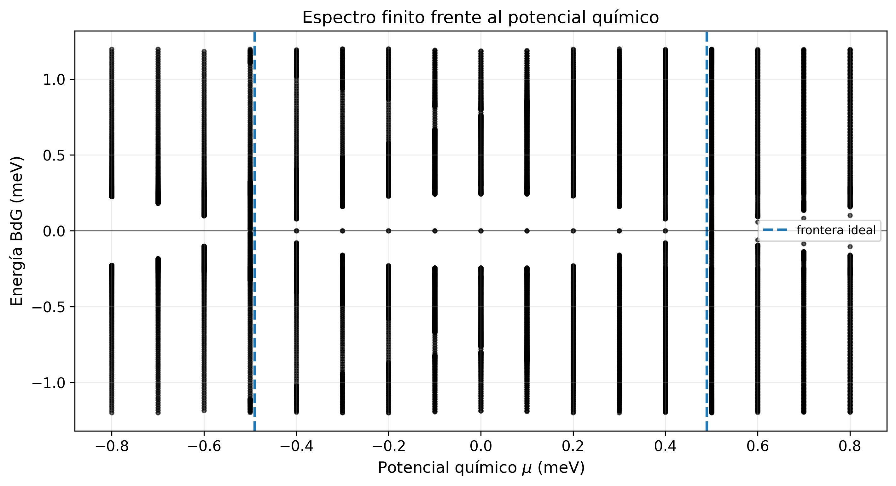

Sweeping $\mu$ changes which effective subband region is occupied. The ideal topological condition depends on $\mu$, so the near-zero region shifts as the chemical potential changes. This figure is important for device interpretation because gates tune the effective chemical potential in experiments.

### 3.6 Ideal phase diagram in the $\mu$-$E_Z$ plane

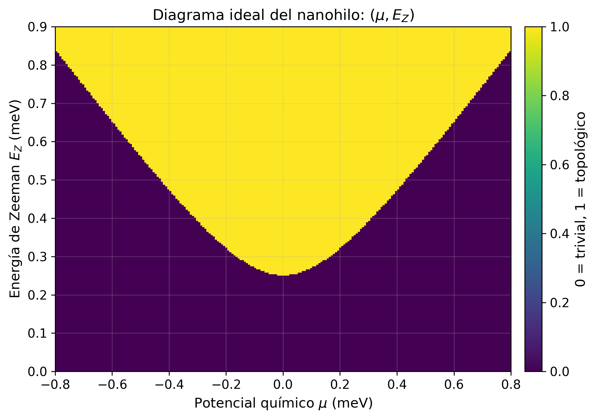

The ideal phase diagram shows the homogeneous topological criterion. It is useful as a guide, but it is not a full finite-device solution. The difference between this ideal boundary and the finite-device low-energy map is precisely where interesting interpretation problems arise.

### 3.7 Finite minimum-energy map

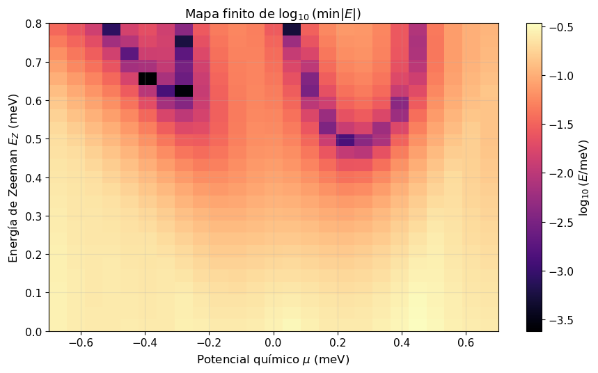

The finite map plots the minimum absolute energy on a logarithmic scale. It shows where the finite wire has near-zero states. Comparing this map to the ideal phase diagram helps identify whether near-zero states align with the expected topological region or whether smooth confinement and inhomogeneity create additional low-energy features.

### 3.8 Bulk-edge comparison

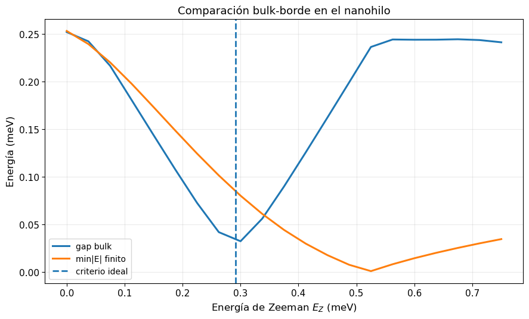

This diagnostic compares bulk expectations with finite-edge signatures. It is one of the most conceptually important figures in the repository because it prevents overinterpretation of a single finite-chain eigenvalue. A convincing Majorana interpretation should be compatible with both a bulk topological transition and edge-localized finite modes.

### 3.9 Bulk gap diagnostic

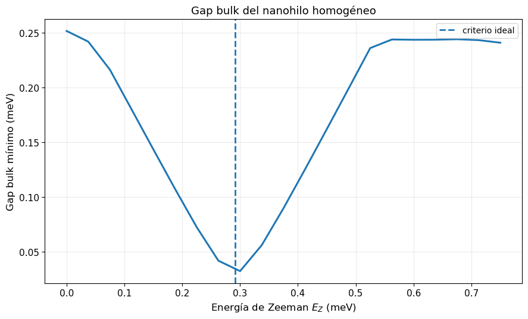

The bulk gap plot isolates the homogeneous gap closing/reopening physics. It provides a clean baseline for the more complicated finite-device spectra. If a near-zero finite mode appears without a compatible bulk-gap story, that state requires extra caution.

### 3.10 Local density of states

The LDOS shows the spatial and energetic distribution of spectral weight. In the topological regime, low-energy weight should concentrate near the wire ends. However, smooth potentials can also localize subgap states near an end. The LDOS is therefore powerful but must be combined with Majorana decomposition and bulk diagnostics.

### 3.11 Lowest-energy state density

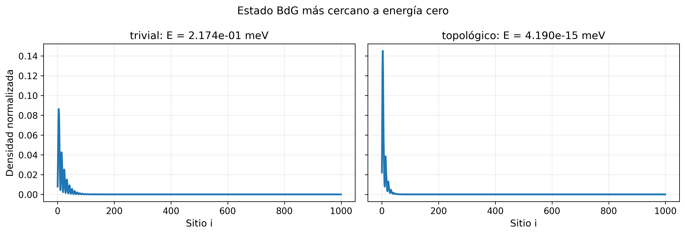

The density of the lowest-energy state shows whether the state is extended, single-end localized, or two-end localized. A topological Majorana pair should produce a nonlocal fermionic state whose density has contributions from both boundaries. A state localized only near one smooth potential region is less convincing as a topological Majorana pair.

### 3.12 Majorana decomposition

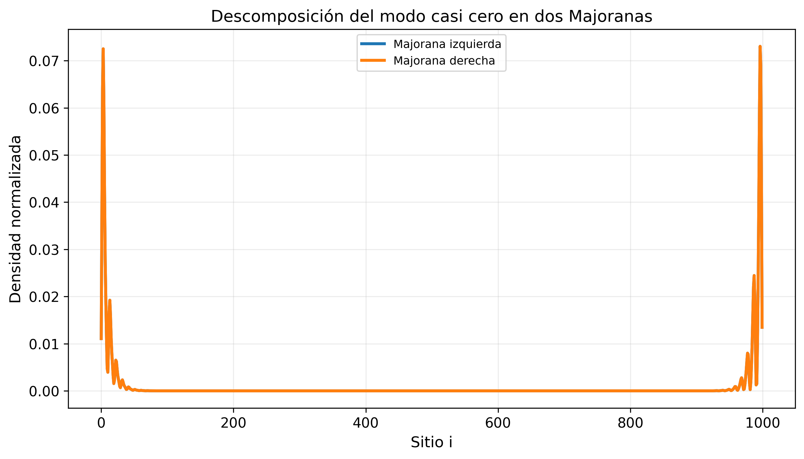

This figure decomposes the near-zero state into Majorana-like components. It is stronger than the total density plot because it distinguishes truly separated Majorana components from a conventional Andreev state that happens to be near zero. The desired topological pattern is one component on the left and the other on the right.

### 3.13 Particle-hole content

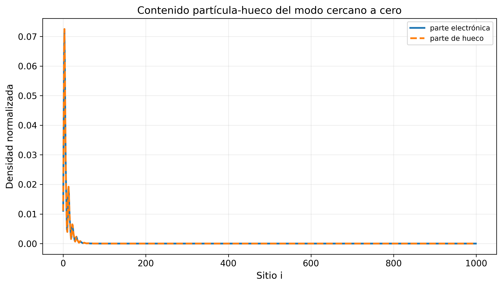

Particle-hole balance is a basic BdG requirement for ideal zero modes. A near-zero state should have approximately balanced electron and hole weights. If the state is strongly electron-like or hole-like, it is less consistent with an ideal Majorana interpretation.

### 3.14 BdG charge

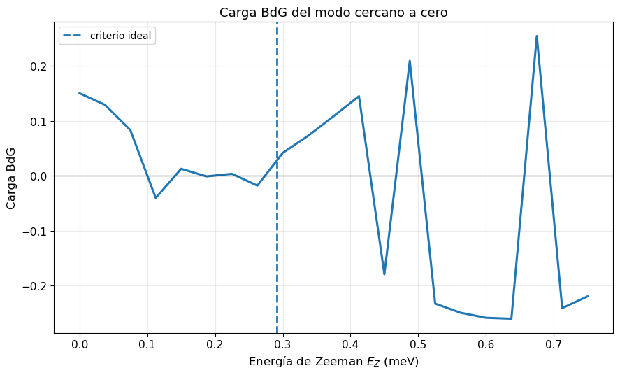

The BdG charge diagnostic condenses electron-hole imbalance into a single curve. Majorana-like modes should be nearly charge neutral. This diagnostic helps separate neutral zero-mode-like excitations from ordinary quasiparticles.

### 3.15 Spin polarization

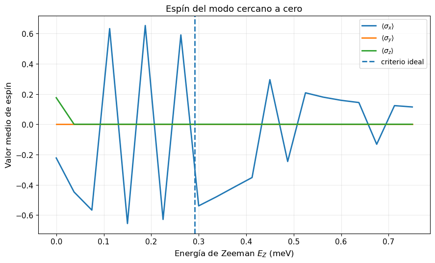

Spin polarization is not a topological invariant, but it is informative in Rashba-Zeeman nanowires. It shows how the low-energy state evolves under the field that drives the transition. It is especially useful when comparing states that are close in energy but have different physical character.

### 3.16 Rashba sweep

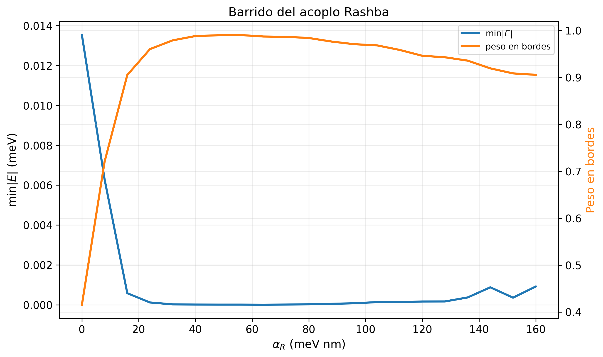

The Rashba sweep probes the role of spin-orbit coupling. Spin-orbit coupling is essential because it allows s-wave pairing to produce an effective p-wave component after the Zeeman field creates a spin-split low-energy band. If Rashba coupling is too weak, the topological gap and localization properties become poor.

### 3.17 Alpha-Zeeman map

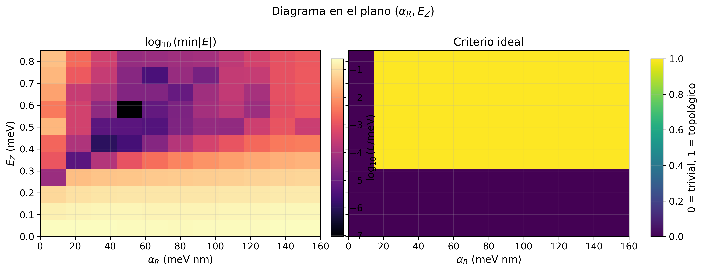

The $\alpha_R$-$E_Z$ map shows how changing spin-orbit coupling shifts finite low-energy signatures. It helps demonstrate that Majorana physics is not controlled by a single parameter. The topological gap, localization length, and robustness depend jointly on spin-orbit coupling, Zeeman field, chemical potential, and induced pairing.

### 3.18 Induced gap and localization

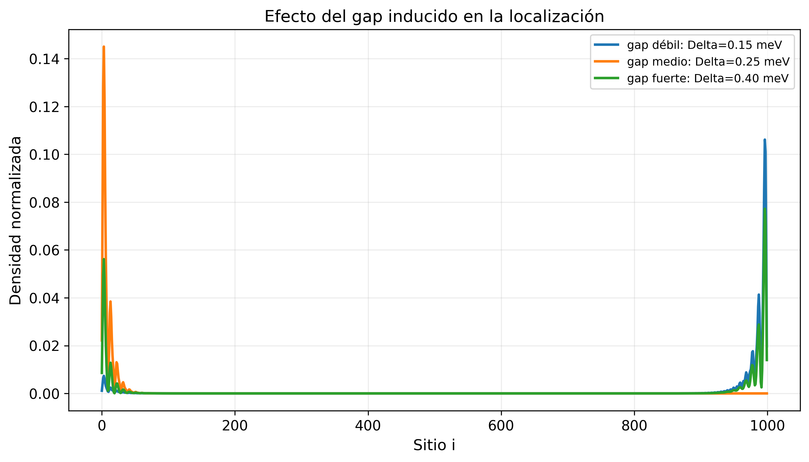

Increasing the induced gap changes the localization properties of boundary modes. A larger gap typically shortens the coherence length and localizes modes more strongly, although it also changes the ideal transition threshold. This figure links the experimentally tunable induced superconducting scale to the spatial quality of Majorana signatures.

### 3.19 Localization length

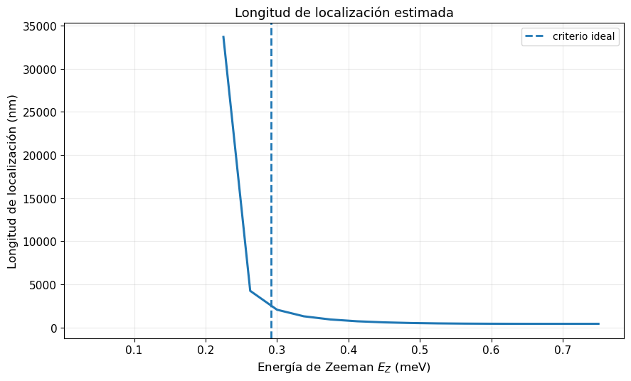

The localization-length diagnostic estimates how far the low-energy state extends into the bulk. Good Majorana separation requires a wire length much larger than the localization length. If the localization length is comparable to the system length, finite-size splitting and overlap remain significant.

### 3.20 Mesh convergence

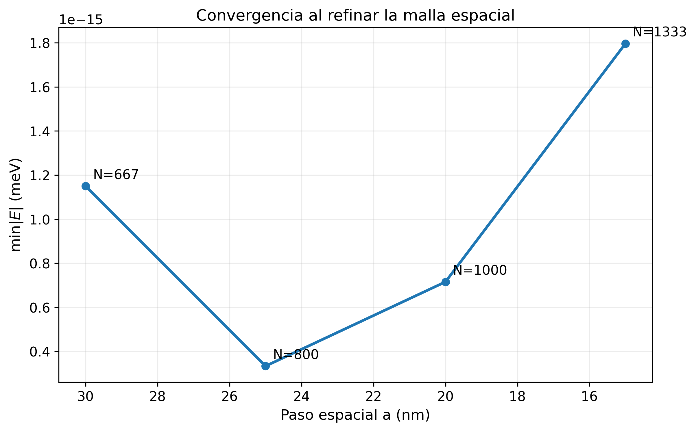

The mesh-convergence plot checks that the finite-difference discretization is not producing artificial results. Refining the spatial step changes the hopping scale $t=\hbar^2/(2m^*a^2)$ and the spin-orbit hopping $t_{\mathrm{so}}=\alpha_R/(2a)$. A stable result under mesh refinement is necessary before interpreting the physics.

### 3.21 Barrier sweep

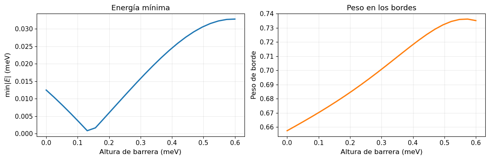

The barrier sweep shows how a smooth electrostatic feature near the end affects low-energy states. This is a key realistic effect: gate-defined barriers and smooth confinement can create ordinary Andreev bound states that approach zero energy. Such states may mimic part of the Majorana phenomenology, so this figure is included as a cautionary diagnostic.

### 3.22 Inhomogeneity

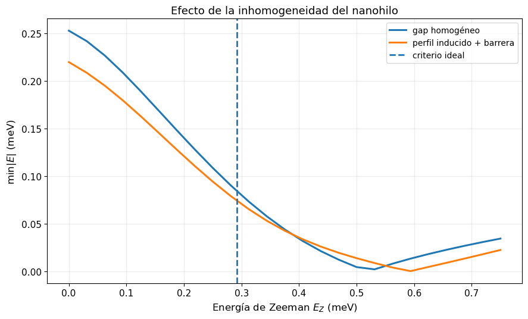

Spatial inhomogeneity can change the local effective chemical potential and produce additional subgap features. The plot emphasizes that experimental devices are not perfectly homogeneous Kitaev chains. A robust analysis must test whether the apparent Majorana signatures survive realistic nonuniformity.

---

## 4. Quasi-Majorana / smooth-potential case study

### 4.1 Spatial profiles

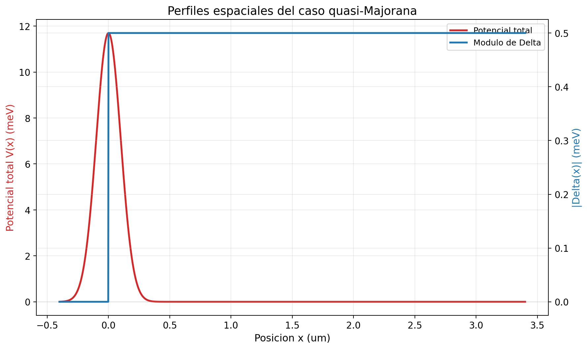

The quasi-Majorana case uses smooth spatial profiles to create a low-energy state that can partially resemble a Majorana mode. This is included because it reflects one of the most important interpretive challenges in the field: smooth confinement can create partially separated Andreev bound states.

### 4.2 Subgap spectrum versus Zeeman energy

The subgap spectrum shows a low-energy state approaching zero. On its own, this could look similar to a Majorana signature. The purpose of the case study is to show why the spectrum alone is insufficient.

### 4.3 Bulk gap and ideal criterion

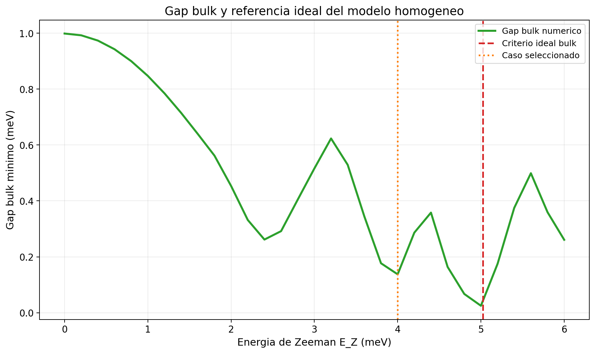

The bulk diagnostic provides the reference topological criterion. If a near-zero finite state appears before the corresponding bulk topological transition, the state should be interpreted carefully. It may be a quasi-Majorana or Andreev bound state rather than a topological end-mode pair spanning the full wire.

### 4.4 Bulk bands at selected point

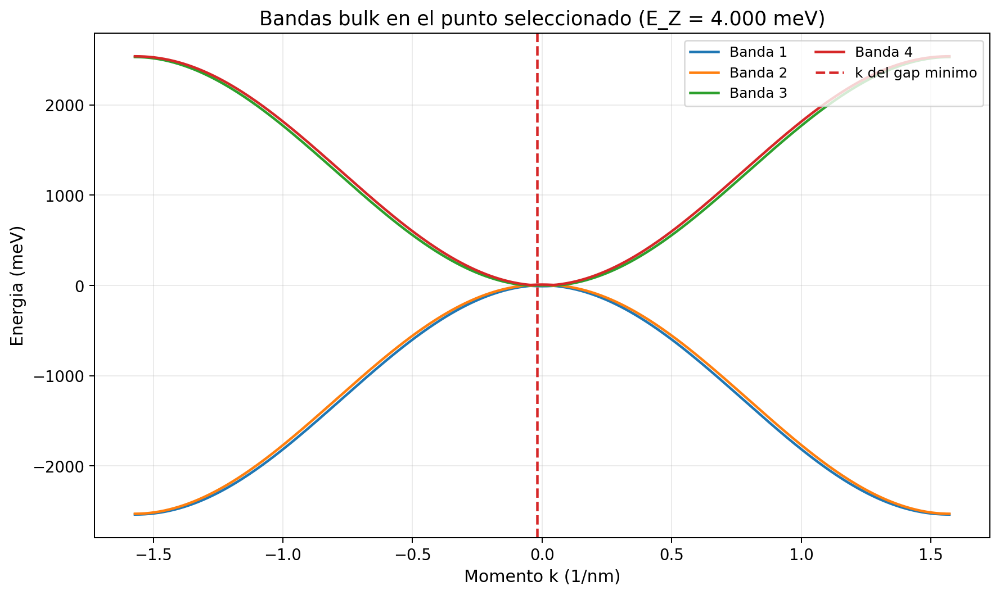

The selected-point bulk bands show the homogeneous reference model at the operating point used for the quasi-Majorana analysis. This helps separate local smooth-potential physics from global topological-band physics.

### 4.5 Near-zero state density

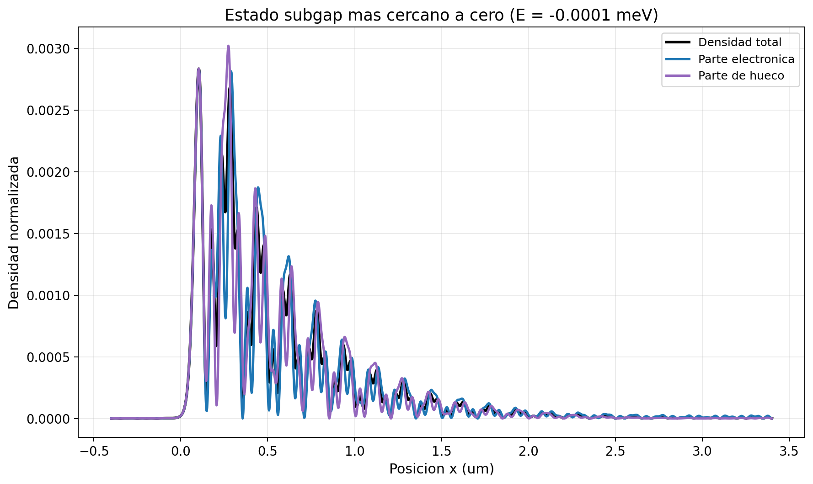

The near-zero state density may show strong localization near one side of the device. That can produce a zero-energy-like signature in local tunneling, but it does not necessarily imply two Majoranas separated across the full nanowire.

### 4.6 Majorana decomposition

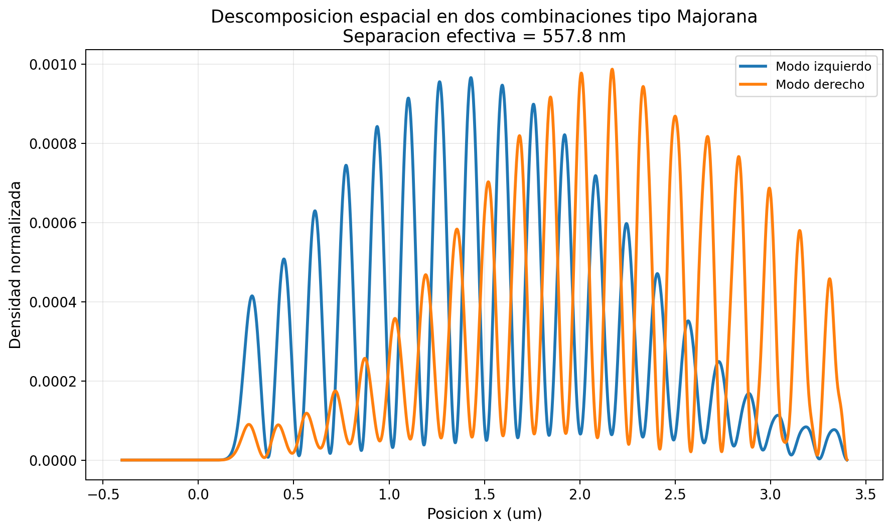

The decomposition checks whether the two Majorana-like components are truly separated between opposite ends or only partially separated within the same end region. This distinction is central: a partially separated Andreev state can have a very small energy while lacking full topological nonlocality.

### 4.7 Local observables

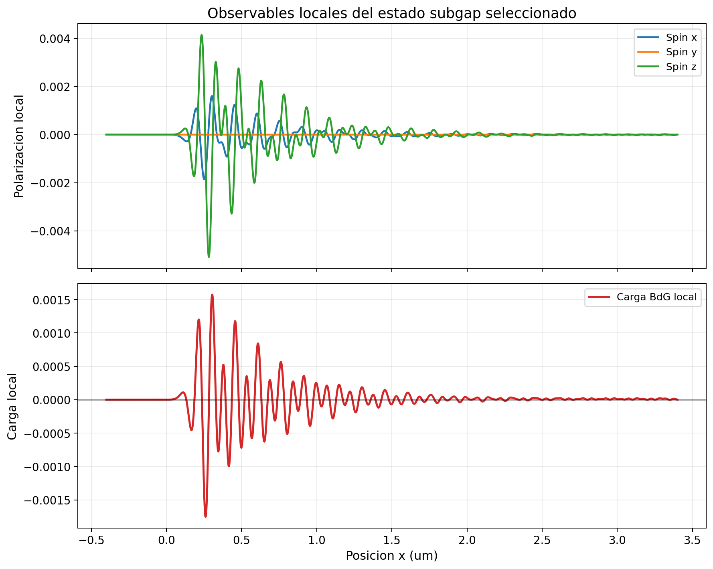

The local-observable plot collects diagnostics such as density, particle-hole structure, charge, and spin. The message is that a convincing interpretation requires consistency across multiple observables. A single zero-energy feature is not enough.

---

## 5. Overall interpretation

The figures form a coherent story.

The Kitaev-chain results establish the clean topological mechanism: bulk gap closing, reopened topological phase, and boundary Majorana modes in open chains.

The self-consistent BdG results add physical feedback: the superconducting order parameter is determined by the eigenstates and is suppressed by Zeeman physics. This makes the model more realistic than a fixed-gap toy model while still being controlled.

The proximitized nanowire results add device effects: induced superconductivity, Rashba coupling, Zeeman splitting, electrostatic barriers, smooth interfaces, and inhomogeneity. These effects make the simulations closer to experiments but also make interpretation more subtle.

The quasi-Majorana case makes the caution explicit: smooth potentials can produce near-zero states that partially imitate Majorana signatures. The correct conclusion is therefore not simply “zero energy equals Majorana.” The correct conclusion is that Majorana candidates should be evaluated through a full diagnostic package: bulk topology, finite spectra, LDOS, edge localization, particle-hole balance, Majorana-component separation, finite-size scaling, and stability under parameter changes.
