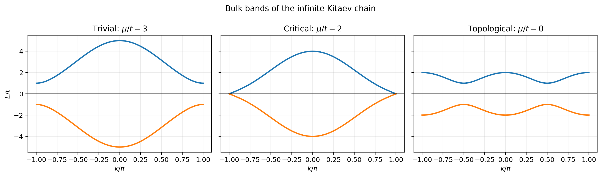
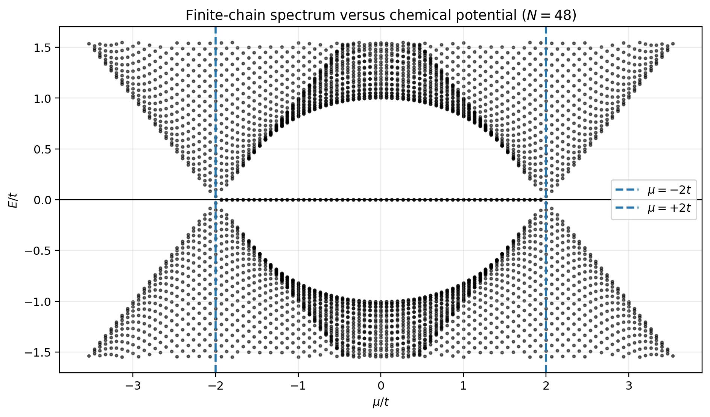
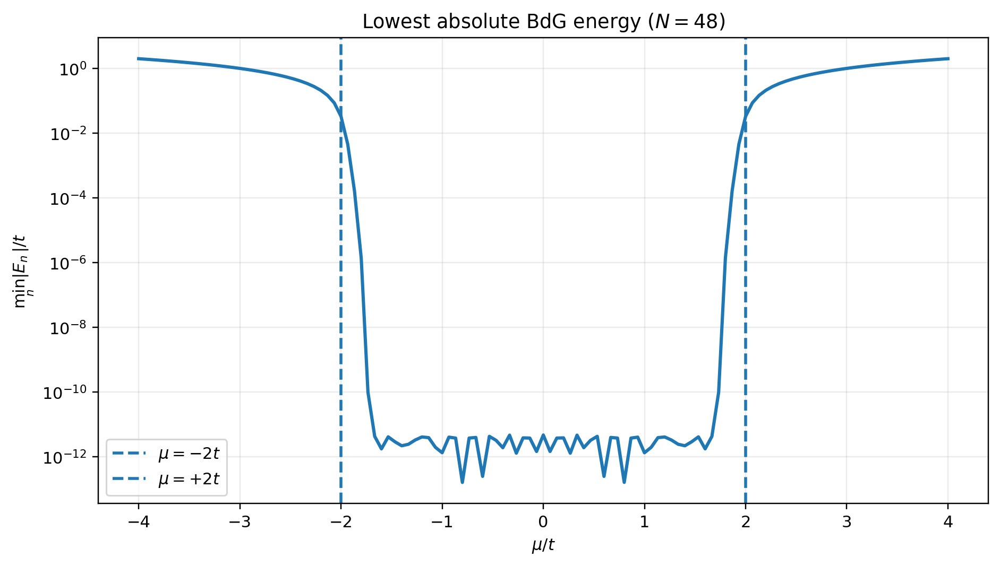
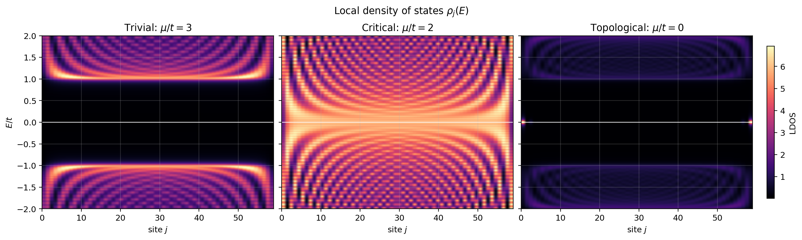
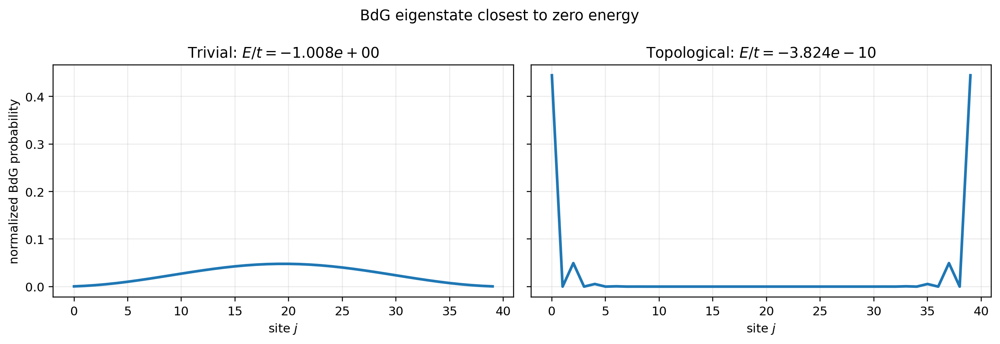
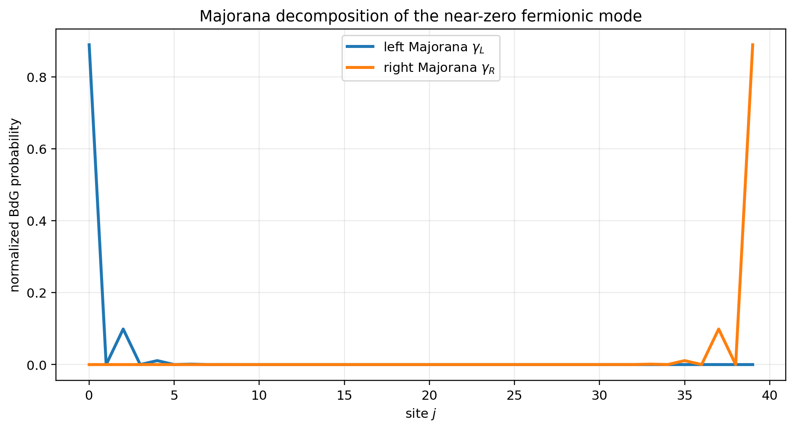
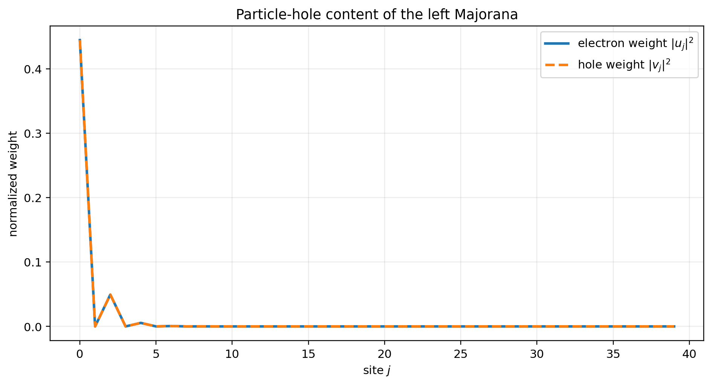
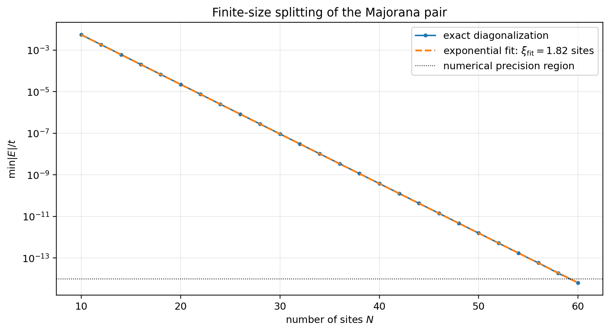
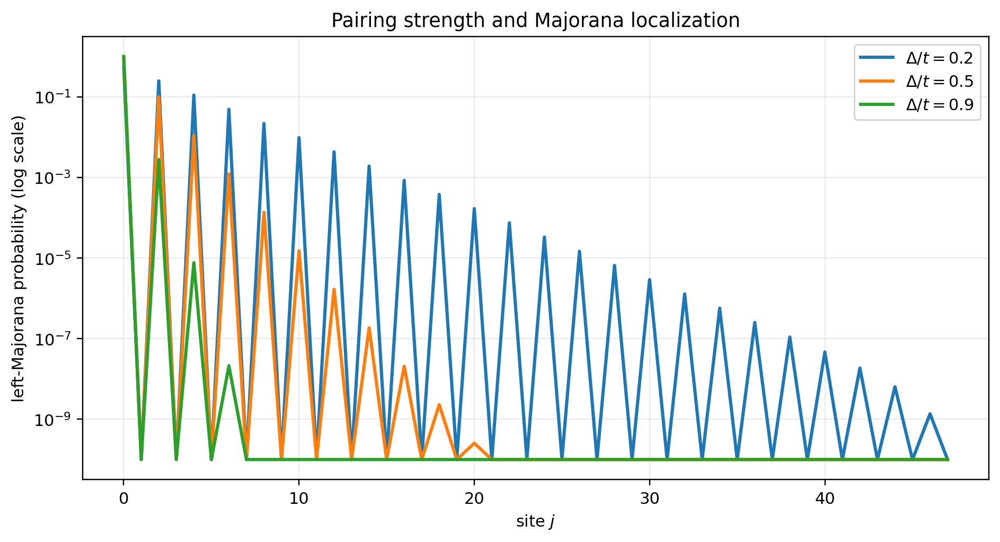
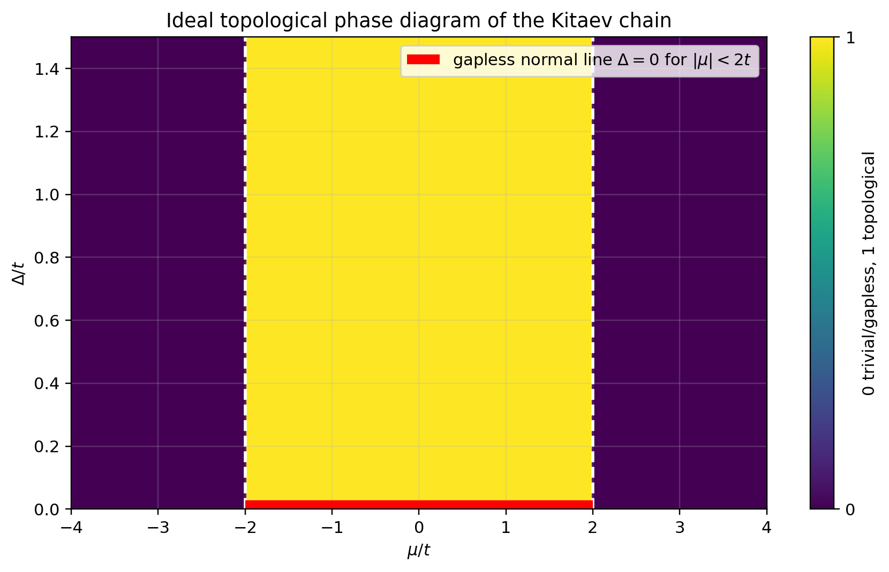

# Verified Numerical Results for the One-Dimensional Kitaev Chain

*Figure-by-figure interpretation and conclusions*

Technical documentation for `majorana-bdg-nanowire-simulations`

July 2026

# Abstract

This report presents a verified set of Kitaev-chain results generated from the same Hamiltonian convention as `src/kitaev_chain_1d.py`, while correcting the electron–hole probability definition and stabilizing the extraction of Majorana components. Every figure is accompanied by two distinct explanations: first, what quantity is calculated, how it is constructed, and what physical signature is sought; second, what the displayed result actually shows and what can and cannot be concluded from it. Numerical values are included where they strengthen the interpretation. The final section assembles the separate diagnostics into a coherent evidence chain for Majorana zero modes in the ideal finite Kitaev model.

# Contents

1. Calculation protocol and verification
   1. Hamiltonian and parameters
   2. Corrections applied to the analysis
   3. Numerical validation
2. Bulk and finite-spectrum results
   1. Bulk bands in the trivial, critical, and topological regimes
   2. Finite-chain spectrum versus chemical potential
   3. Minimum absolute energy versus chemical potential
3. Spatially resolved spectral results
   1. Local density of states in three regimes
4. Edge-state structure
   1. State closest to zero: trivial versus topological
   2. Decomposition into left and right Majorana modes
   3. Electron and hole composition of a Majorana
5. Finite-size and parameter dependence
   1. Exponential splitting with chain length
   2. Pairing strength and Majorana localization
6. Topological phase diagram
   1. Majorana number in the $(\mu,\Delta)$ plane
7. Integrated interpretation and conclusions
   1. Evidence chain for Majorana zero modes
   2. What the calculation does not prove
   3. Final conclusions

# Chapter 1

## Calculation protocol and verification

### 1.1 Hamiltonian and parameters

The finite-chain calculations use

$$
H_{\mathrm{BdG}}=\begin{pmatrix}h&\Delta\\-\Delta^*&-h^*\end{pmatrix},
$$

<strong>(1.1)</strong>

with

$$
h_{jj}=-\mu,\qquad h_{j,j+1}=h_{j+1,j}=-t,\qquad \Delta_{j,j+1}=+\Delta,\qquad \Delta_{j+1,j}=-\Delta.
$$

<strong>(1.2)</strong>

Unless a caption states otherwise,

$$
t=1,\qquad \Delta=0.5,\qquad \mu_{\mathrm{trivial}}=3,\qquad \mu_{\mathrm{critical}}=2,\qquad \mu_{\mathrm{topological}}=0.
$$

<strong>(1.3)</strong>

The hopping is the energy unit. Open boundary conditions are used for finite chains. Bulk bands use the exact infinite-chain dispersion.

Different chain lengths are used deliberately. $N=48$ is used for the finite spectrum and minimum-energy scan, $N=60$ for the LDOS, and $N=40$ for detailed edge-state and Majorana decompositions. At $N=40$, the near-zero splitting is still resolvable at approximately $3.824\times10^{-10}t$. This prevents a strict-sign classification failure while preserving excellent spatial separation.

### 1.2 Corrections applied to the analysis

The probabilities shown in the electron–hole figure are

$$
|u_j|^2\qquad\text{and}\qquad |v_j|^2,
$$

<strong>(1.4)</strong>

not $u_j^2$ and $v_j^2$. The Majorana components are constructed from a state and its antiunitary particle–hole image, then normalized individually. This yields self-conjugacy errors equal to zero to the reported numerical precision and avoids searching for a negative eigenvalue when the zero doublet is unresolved.

### 1.3 Numerical validation

Representative checks gave:

$$
\max_{ij}|H_{ij}-H_{ji}^*|=0,
$$

<strong>(1.5)</strong>

$$
\max_n|E_n+E_{2N-1-n}|<8.0\times10^{-15}t,
$$

<strong>(1.6)</strong>

$$
\max_n\|H\mathcal{C}\Phi_n+E_n\mathcal{C}\Phi_n\|<2.0\times10^{-14}t.
$$

<strong>(1.7)</strong>

These values confirm that the matrix is Hermitian, the spectrum is particle–hole symmetric, and the implemented antiunitary transformation maps every eigenvector to a partner at the opposite energy within double-precision accuracy.

# Chapter 2

## Bulk and finite-spectrum results

### 2.1 Bulk bands in the trivial, critical, and topological regimes

**Figure 2.1:** Bulk bands of the infinite Kitaev chain for $\mu/t=3$, $2$, and $0$, with $\Delta/t=0.5$.

#### What is calculated and why

For a translationally invariant chain, the $2\times2$ Bloch BdG Hamiltonian is

$$
H_{\mathrm{BdG}}(k)=(-\mu-2t\cos k)\tau_z-2\Delta\sin k\,\tau_y,
$$

<strong>(2.1)</strong>

with eigenvalues

$$
E_{\pm}(k)=\pm\sqrt{(-\mu-2t\cos k)^2+(2\Delta\sin k)^2}.
$$

<strong>(2.2)</strong>

The plot evaluates this expression across the Brillouin zone. It is the cleanest way to identify a bulk gap closing and reopening because no finite boundaries or edge modes are present. The target signature is a gapped trivial spectrum, a closing at $|\mu|=2t$, and a reopened gapped spectrum with a different topological invariant.

#### Result and interpretation

At $\mu=3t$, the spectrum is gapped and topologically trivial. The minimum occurs at $k=\pi$, where the odd-parity pairing vanishes and $|E|=|-3t+2t|=t$. At $\mu=2t$, the positive and negative branches meet at $k=\pi$, demonstrating the required bulk gap closing. At $\mu=0$, the gap has reopened. The minimum is $E_{\mathrm{gap}}=t$ at $k=\pm\pi/2$ for $\Delta=0.5t$. The reopening is not merely a return to the same phase: the signs of the normal-state masses at $k=0$ and $k=\pi$ are now opposite, so the Majorana number is non-trivial.

This figure establishes the bulk transition, but it does not show boundary states because the calculation has no ends. It must therefore be combined with finite-chain localization results rather than interpreted as direct evidence of an edge Majorana by itself.

### 2.2 Finite-chain spectrum versus chemical potential

**Figure 2.2:** Low-energy spectrum of an open chain with $N=48$ as the chemical potential is swept.

#### What is calculated and why

For each of 121 values of $\mu/t$ between $-4$ and $4$, the full $96\times96$ Hermitian BdG matrix is diagonalized. Only eigenvalues with $|E|<1.55t$ are displayed so the transition and subgap structure are visible. The dashed lines mark the thermodynamic phase boundaries $\mu=\pm2t$. This figure connects the infinite-chain prediction to the spectrum of the actual open system used for edge-state calculations.

The expected signatures are exact $\pm E$ symmetry, finite-size levels representing quantized bulk states, gap softening near the transition, and a pair of states exponentially close to zero inside the topological interval. The near-zero pair corresponds to one non-local fermionic degree of freedom built from two overlapping boundary Majoranas.

#### Result and interpretation

The spectrum is symmetric around $E=0$ across the entire sweep, as required by BdG particle–hole symmetry. Outside $|\mu|<2t$, the closest levels remain at finite energy and approach the bulk continuum. Near $\mu=\pm2t$, the finite-size level spacing prevents an exact zero at the transition: for $N=48$, the smallest positive energy at $\mu=2t$ is approximately $0.0333t$. This is the expected finite-chain replacement of the thermodynamic gap closing.

Inside the topological interval, a near-zero doublet separates from the bulk bands. At $\mu=0$, the minimum absolute energy is approximately $4.72\times10^{-12}t$, whereas the next positive excitation is approximately $1.006t$. Thus the edge doublet is separated from bulk excitations by roughly one hopping unit. The visual distinction between the near-zero line and the bulk bands is a strong finite-chain signature, but the spectrum alone does not prove that the state is localized at opposite ends. The later density and Majorana-decomposition figures provide that missing information.

### 2.3 Minimum absolute energy versus chemical potential

**Figure 2.3:** Minimum absolute BdG energy of the $N=48$ open chain, displayed on a logarithmic scale.

#### What is calculated and why

At every chemical potential, the plotted quantity is

$$
E_{\min}(\mu)=\min_n|E_n(\mu)|.
$$

<strong>(2.3)</strong>

A logarithmic vertical scale is essential because the edge-state splitting can be many orders of magnitude smaller than the bulk energy scale. The purpose is to identify the parameter interval in which an exponentially small finite-chain state exists and to compare it with the ideal phase boundaries.

This quantity is not the bulk gap in the topological regime. Once Majorana edge states appear, $E_{\min}$ measures their hybridization energy. The bulk gap is associated with the next positive-energy state after excluding the near-zero pair, or with the minimum of the infinite-chain dispersion.

#### Result and interpretation

The minimum energy drops rapidly as the sweep enters $|\mu|<2t$ and remains between roughly $10^{-10}t$ and $10^{-13}t$ over much of the central region for $N=48$. The small oscillations and sharp dips are finite-size interference effects: the overlap contains an oscillatory factor as well as an exponential envelope, so particular values of $\mu$ can produce accidental suppression of the splitting.

Outside the topological interval, $E_{\min}$ rises to the ordinary gap scale. At $\mu=3t$, the finite-chain minimum is approximately $1.006t$, close to the bulk value $t$. The smooth rounding near $\mu=\pm2t$ reflects finite size. The figure correctly identifies the topological interval but should never be used alone to call every near-zero state a Majorana in an inhomogeneous realistic device; localization and bulk consistency are necessary.

# Chapter 3

## Spatially resolved spectral results

### 3.1 Local density of states in three regimes

**Figure 3.1:** Lorentzian-broadened site-resolved spectral weight for $N=60$, using $\eta=0.04t$.

#### What is calculated and why

For every eigenstate, the normalized site probability is

$$
p_n(j)=|u_{nj}|^2+|v_{nj}|^2.
$$

<strong>(3.1)</strong>

The displayed spectral weight is

$$
\rho_j(E)=\sum_n p_n(j)\frac{\eta}{\pi[(E-E_n)^2+\eta^2]}.
$$

<strong>(3.2)</strong>

The Lorentzian broadening converts discrete finite-chain levels into continuous-looking ridges. Horizontal position identifies energy, vertical position in the panel identifies the site, and color shows the amount of spectral weight. The desired distinction is: no zero-energy weight in the trivial gap, spatially extended low-energy weight at the critical point, and zero-energy weight confined to the two boundaries in the topological phase.

The plotted quantity is a symmetric BdG spectral-weight visualization. A literal electron tunnelling LDOS would weight positive and negative energies with $|u|^2$ and $|v|^2$ separately. For the qualitative boundary comparison made here, the symmetric definition is appropriate as long as it is labelled explicitly.

#### Result and interpretation

In the trivial panel, a clean dark window extends approximately from $-t$ to $+t$. No zero-energy spectral weight appears at either boundary or in the interior. The lowest ridges bend because open boundaries quantize the normal momentum, but the gap remains robust.

At the critical value $\mu=2t$, low-energy weight fills the gap and extends across the full chain. This spatial extension is important: it distinguishes a bulk critical mode from a boundary-localized zero mode. In the topological panel, the bulk gap has reopened to approximately $t$, while bright spots at $E=0$ appear only at the first and last sites. This simultaneous combination – reopened bulk gap plus terminal zero-energy weight – is the characteristic bulk–boundary pattern of the ideal Kitaev chain.

The finite Lorentzian width makes the zero-energy peaks occupy a small energy interval. Their apparent width is controlled by $\eta$, not by the physical splitting, which is far smaller in this calculation.

# Chapter 4

## Edge-state structure

### 4.1 State closest to zero: trivial versus topological

**Figure 4.1:** Spatial probability of the BdG eigenstate closest to zero for $N=40$.

#### What is calculated and why

For each regime, the eigenvector with minimum $|E|$ is selected and its site probability $|u_j|^2+|v_j|^2$ is plotted. This is the simplest direct spatial diagnostic. A trivial low-energy state should resemble an ordinary standing wave and remain at finite energy. A topological near-zero fermionic state should contain weight near both ends because it is formed from a left and a right Majorana.

The total density of the near-zero fermion cannot by itself separate the two Majorana components. It should therefore show two terminal peaks, while the next figure rotates the same low-energy sector into individually left- and right-localized self-conjugate combinations.

#### Result and interpretation

For $\mu=3t$, the nearest state has energy $E\approx-1.0085t$. Its probability is an extended standing-wave profile with only about $1.01\%$ of the total weight in the first four sites and the same amount in the last four. This is not an edge state and is separated from zero by the trivial gap.

For $\mu=0$, the nearest state has $E\approx-3.824\times10^{-10}t$. Approximately $49.38\%$ of its probability lies in the first four sites and $49.38\%$ in the last four, so more than $98.76\%$ is contained in eight terminal sites. The two-end structure is exactly what is expected for the non-local fermion formed by the two boundary Majoranas. The small secondary peaks reflect the alternating-site structure of the analytic $\mu=0$ solution. Although this plot establishes edge localization, the displayed eigenvector is still a complex fermionic quasiparticle and is not yet an individually self-conjugate left or right Majorana.

### 4.2 Decomposition into left and right Majorana modes

**Figure 4.2:** Stable particle–hole construction of two self-conjugate Majorana wavefunctions from the near-zero BdG state at $N=40$, $\mu=0$, and $\Delta=0.5t$.

#### What is calculated and why

Let $\Phi_E=(u,v)^T$ be a normalized BdG eigenvector at the smallest resolvable positive energy. In the code basis, particle–hole conjugation is

$$
\mathcal{C}\Phi_E=\tau_x\Phi_E^*=\begin{pmatrix}v^*\\u^*\end{pmatrix}.
$$

<strong>(4.1)</strong>

The two Hermitian combinations are

$$
\Gamma_1=\frac{\Phi_E+\mathcal{C}\Phi_E}{\|\Phi_E+\mathcal{C}\Phi_E\|},
$$

<strong>(4.2)</strong>

$$
\Gamma_2=\frac{-i(\Phi_E-\mathcal{C}\Phi_E)}{\|\Phi_E-\mathcal{C}\Phi_E\|}.
$$

<strong>(4.3)</strong>

They satisfy $\mathcal{C}\Gamma_a=\Gamma_a$ and correspond to Majorana quasiparticle operators $\gamma_a=\gamma_a^\dagger$. A final real orthogonal rotation within the two-dimensional near-zero subspace is chosen to maximize left–right separation. The plotted densities are

$$
p_a(j)=|u_{aj}|^2+|v_{aj}|^2,\qquad \sum_j p_a(j)=1.
$$

<strong>(4.4)</strong>

This subspace method is preferred to pairing eigenvectors solely by the signs of tiny eigenvalues, because finite-size splitting can fall below machine precision.

#### Result and interpretation

The first Majorana is confined to the left boundary and the second to the right. The integrated left-half weights are

$$
W_L(\Gamma_L)=0.9999999997,\qquad W_L(\Gamma_R)=2.87\times10^{-10}.
$$

<strong>(4.5)</strong>

Thus the two components are spatially separated to better than one part in $10^9$ for this chain length. Their particle–hole self-conjugacy residuals vanish to the reported floating-point precision, and their overlap is $|\langle\Gamma_L|\Gamma_R\rangle|\approx5.9\times10^{-33}$.

The localization alternates strongly between neighbouring sites. For $\mu=0$, the zero-energy recursion decouples the two sublattices and gives an amplitude ratio

$$
r=-\frac{t-\Delta}{t+\Delta}=-\frac{1}{3}.
$$

<strong>(4.6)</strong>

Consequently, the probability on successive occupied-sublattice sites decreases as $|r|^{2m}=9^{-m}$. The numerical profile follows precisely this exponential, alternating pattern. This agreement with the analytic recursion demonstrates that the terminal peaks are not merely arbitrary near-zero bound states: they have the spatial structure of Kitaev-chain Majorana modes.

### 4.3 Electron and hole composition of a Majorana

**Figure 4.3:** Electron and hole probabilities of the left Majorana mode. Absolute squares are used component by component.

#### What is calculated and why

For a normalized Majorana spinor $\Gamma=(u,v)^T$, the local electron and hole probabilities are

$$
p_e(j)=|u_j|^2,\qquad p_h(j)=|v_j|^2.
$$

<strong>(4.7)</strong>

Self-conjugacy implies $v=u^*$ up to an allowed overall Majorana phase. Therefore,

$$
p_e(j)=p_h(j)
$$

<strong>(4.8)</strong>

site by site, and the integrated BdG charge expectation

$$
Q=e\sum_j\left(|u_j|^2-|v_j|^2\right)=e\,\Gamma^\dagger\tau_z\Gamma
$$

<strong>(4.9)</strong>

vanishes. The purpose of this figure is to test a defining property of a Majorana excitation, not merely to reproduce its spatial localization.

The use of absolute squares is essential. Expressions such as $u_j^2$ are phase-dependent and may be complex; they are anomalous amplitudes rather than probabilities. This distinction is one of the corrections required in the current repository script.

#### Result and interpretation

The electron and hole curves coincide at every site. Their integrated weights are

$$
\sum_j|u_j|^2=0.5000000000,\qquad \sum_j|v_j|^2=0.5000000000,
$$

<strong>(4.10)</strong>

while the dimensionless charge expectation is zero to the reported floating-point precision. This is the expected neutral BdG charge of a self-conjugate Majorana spinor.

Equal electron–hole weight should be interpreted carefully. A BdG quasiparticle is a coherent particle–hole superposition; it is not a classical half-electron plus half-hole object. The equality instead expresses invariance under particle–hole conjugation and the Hermiticity of the corresponding quasiparticle operator. Together with zero energy and edge localization, this supplies a third independent Majorana diagnostic.

# Chapter 5

## Finite-size and parameter dependence

### 5.1 Exponential splitting with chain length

**Figure 5.1:** Finite-size Majorana splitting at $\mu=0$ and $\Delta=0.5t$, together with an exponential fit before the double-precision floor is reached.

#### What is calculated and why

For each chain length $N$, the BdG matrix is diagonalized and the splitting is defined as

$$
E_M(N)=\min_n|E_n(N)|.
$$

<strong>(5.1)</strong>

In an infinitely long topological chain, the left and right Majoranas do not overlap and the energy is exactly zero. In a finite chain, their exponentially decaying tails hybridize. The leading envelope is

$$
E_M(N)\simeq A e^{-N/\xi},
$$

<strong>(5.2)</strong>

possibly multiplied by an oscillatory factor away from special parameter values. A semilogarithmic plot converts the exponential envelope into a straight line and allows the localization length $\xi$ to be estimated independently of the spatial wavefunction.

At $\mu=0$, the analytic amplitude ratio is $|r|=|(t-\Delta)/(t+\Delta)|$, so the wavefunction amplitude at equivalent sublattice sites scales as $e^{-j/\xi}$ with

$$
\xi_{\mathrm{analytic}}=\frac{2}{\ln[(t+\Delta)/|t-\Delta|]}.
$$

<strong>(5.3)</strong>

The factor of two appears because the non-zero amplitudes occupy every second lattice site.

#### Result and interpretation

The computed splitting follows a straight line over the resolved range, confirming exponential suppression with system size. The fit gives

$$
\xi_{\mathrm{fit}}=1.8200\ \text{sites},
$$

<strong>(5.4)</strong>

while the exact $\mu=0$, $\Delta=0.5t$ result is

$$
\xi_{\mathrm{analytic}}=\frac{2}{\ln3}=1.8205\ \text{sites}.
$$

<strong>(5.5)</strong>

The relative disagreement is approximately $2.5\times10^{-4}$, which is consistent with finite fitting range and floating-point effects.

For sufficiently large $N$, the measured eigenvalue stops following the exponential and approaches a numerical floor. This does not mean that the physical splitting has saturated. It means that dense double-precision diagonalization can no longer distinguish the pair from exact zero. Any automated fit must therefore exclude floor-dominated points, and any Majorana construction must operate on the near-zero subspace rather than depend on the signs of unresolved eigenvalues.

### 5.2 Pairing strength and Majorana localization

**Figure 5.2:** Left-Majorana probability for three pairing strengths at $\mu=0$, with all chains in the topological phase.

#### What is calculated and why

The hopping and chemical potential are held fixed while $\Delta/t$ is changed. At $\mu=0$, the boundary amplitude ratio is

$$
r(\Delta)=-\frac{t-\Delta}{t+\Delta}.
$$

<strong>(5.6)</strong>

Increasing $\Delta$ from zero toward $t$ decreases $|r|$ and therefore shortens the localization length. The plotted object is the normalized left-Majorana site probability, extracted from the self-conjugate near-zero subspace. This figure tests whether the numerical wavefunction responds to a parameter exactly as the analytical recurrence predicts.

The phase criterion remains $|\mu|<2|t|$ for every non-zero $\Delta$, so all three curves are topological. The figure compares localization within one phase; it is not a phase-transition scan.

#### Result and interpretation

For $\Delta=0.2t$, the mode has the longest visible tail. Approximately $96.10\%$ of the probability lies in the first eight sites, and the mean site index measured from the left boundary is about $1.60$. For $\Delta=0.5t$, the first-eight-site weight rises to $99.9848\%$ and the mean position falls to $0.25$. For $\Delta=0.9t$, the mode is almost entirely confined to the first site: the first-eight-site weight exceeds $0.9999999999$ and the mean position is about $0.0056$.

The trend is physical and analytic. As $\Delta\to t$, $r\to0$ and the model approaches the exactly dimerized point where the boundary Majorana is an unpaired local operator. As $\Delta\to0^+$, $|r|\to1$ and the localization length diverges because the superconducting gap collapses. Thus stronger pairing produces more robust spatial separation for a fixed chain length, although the ideal phase boundary in $\mu$ does not move.

# Chapter 6

## Topological phase diagram

### 6.1 Majorana number in the $(\mu,\Delta)$ plane

**Figure 6.1:** Ideal class-D phase diagram. The topological region satisfies $|\mu|<2|t|$ for $\Delta\neq0$; the line $\Delta=0$ inside the normal-state band is gapless and is marked separately.

#### What is calculated and why

At the particle–hole-invariant momenta $k=0$ and $k=\pi$, the p-wave pairing term vanishes because $\sin k=0$. The two normal masses are

$$
\varepsilon(0)=-\mu-2t,\qquad \varepsilon(\pi)=-\mu+2t.
$$

<strong>(6.1)</strong>

The class-D $\mathbb{Z}_2$ invariant can therefore be written as

$$
\mathcal{M}=\operatorname{sgn}[\varepsilon(0)\varepsilon(\pi)]=\operatorname{sgn}[(\mu+2t)(\mu-2t)].
$$

<strong>(6.2)</strong>

The phase is non-trivial when $\mathcal{M}=-1$, namely $|\mu|<2|t|$, provided the bulk is superconducting and gapped. The purpose of the diagram is to separate the topological criterion from localization quality: the magnitude of non-zero $\Delta$ changes the gap and localization length but not the vertical phase boundaries of the ideal nearest-neighbour model.

The line $\Delta=0$ requires special treatment. For $|\mu|<2|t|$, the system is an ordinary gapless tight-binding metal, so no one-dimensional superconducting topological invariant is defined there. It must not be coloured as a gapped topological phase.

#### Result and interpretation

The central region between $\mu=-2t$ and $\mu=+2t$ is topological for either sign of non-zero pairing. Changing the sign of real $\Delta$ reverses a phase or winding convention but does not change the $\mathbb{Z}_2$ class. The exterior regions are gapped and trivial because the normal dispersion never crosses the chemical potential in a way that can be paired into the non-trivial phase.

The red horizontal strip explicitly identifies the gapless $\Delta=0$ segment. The vertical boundaries coincide with the gap closings seen in the bulk-band and finite-spectrum figures. This consistency is important: a phase diagram should be derived from the bulk Hamiltonian, while edge-state calculations should confirm its bulk–boundary consequences rather than define the phase by visual inspection alone.

# Chapter 7

## Integrated interpretation and conclusions

### 7.1 Evidence chain for Majorana zero modes

No single plot is sufficient by itself. The verified calculation establishes the ideal Kitaev-chain Majorana phase through a sequence of mutually consistent observations:

1. The infinite-chain bands close at $\mu=\pm2t$ and reopen for $|\mu|<2t$.
2. The bulk $\mathbb{Z}_2$ invariant changes sign across the same boundaries.
3. An open finite chain develops an isolated, particle–hole-symmetric near-zero doublet only in the topological interval.
4. The low-energy spectral weight is boundary-localized while the bulk gap is reopened.
5. The near-zero fermionic state separates into two normalized, self-conjugate, mutually orthogonal components localized at opposite ends.
6. Each component has equal electron and hole probability and vanishing BdG charge.
7. The finite-size energy splitting decays exponentially with a fitted localization length matching the analytic recurrence.
8. The spatial decay changes with $\Delta$ exactly as predicted by the closed-form amplitude ratio.

Together, these results verify the complete bulk–boundary picture of the finite ideal Kitaev chain.

### 7.2 What the calculation does not prove

The model is intentionally minimal. It assumes a clean, spinless, non-interacting chain with static mean-field pairing. It does not include spin, spin–orbit coupling, Zeeman energy, orbital effects, electrostatic inhomogeneity, disorder, interactions beyond mean field, finite temperature, dissipation, tunnel probes, or realistic material parameters. Consequently, the results demonstrate the numerical and theoretical physics of the Kitaev model; they do not claim that a particular experimental nanowire hosts Majorana zero modes.

The ideal model also makes some diagnostics unusually clean. In realistic systems, trivial Andreev bound states can approach zero energy and mimic individual signatures. A defensible experimental interpretation requires correlated evidence such as gap closing and reopening, end-to-end correlations, parameter stability, non-locality, and exclusion of alternative mechanisms. These limitations should be stated in the GitHub documentation to distinguish rigorous modelling from overclaiming.

### 7.3 Final conclusions

The real-space Hamiltonian implemented by the repository is a correct finite Kitaev-chain BdG model. Its bulk dispersion, phase boundaries, particle–hole symmetry, and topological regime agree with the analytical solution. After correcting probability definitions and using a numerically stable near-zero-subspace construction, the computed modes satisfy all defining properties expected in this model: exponentially small energy, opposite-end localization, self-conjugacy, equal particle–hole content, and exponentially suppressed overlap.

The most important repository-level conclusion is methodological. Figures should not be presented as isolated illustrations. Each should state the operator or mathematical quantity being evaluated, the numerical algorithm used to obtain it, the physical signature being tested, the measured result, and the limitations of the inference. Organizing the final GitHub material in this way will make the Kitaev-chain folder a credible theoretical and computational foundation for the later, more realistic Majorana-nanowire simulations.

> **Recommended concise conclusion for the future GitHub chapter**
>
> The Kitaev-chain calculation demonstrates the bulk–boundary correspondence of a one-dimensional class-D topological superconductor. The topological region $|\mu|<2|t|$ is identified from the bulk gap closing and $\mathbb{Z}_2$ invariant. In an open finite chain, this regime supports a near-zero fermionic state whose particle–hole combinations form two self-conjugate modes localized at opposite boundaries. Their overlap and energy splitting decay exponentially with chain length, with a localization length consistent with the exact real-space recurrence.
