# Results and Conclusions

## Realistic proximitized nanowire with Hartree electrostatics

> All figures in this volume are the original supplied TFG figures. They have not been recalculated, redrawn, recoloured or numerically altered. The accompanying English text closely follows the structure and physical interpretation of the TFG while separating, for every figure, what is calculated from what the result means.

*Technical results document in English*

# Contents

1. How the evidence should be read
2. Proximity and electrostatic profiles
   1. Induced pairing and renormalization
   2. Hartree convergence
   3. External, Hartree and effective potentials
   4. Self-consistent density
3. Homogeneous bulk bands
   1. Complete effective-band spectrum
   2. Continuous and discrete bulk spectra
   3. Subgap zoom
4. Finite spectrum across parameter space
   1. Zeeman sweep
   2. Zeeman-sweep zoom
   3. Chemical-potential sweep
   4. Chemical-potential-sweep zoom
5. Local density of states
6. Near-zero wavefunctions and internal BdG structure
   1. Majorana-like left/right decomposition
   2. Electron and hole content
7. Integrated conclusion

# Chapter 1

## How the evidence should be read

The objective is not to identify a Majorana mode from one isolated near-zero eigenvalue. Smooth confinement, finite size and inhomogeneous electrostatics can all create ordinary Andreev bound states at low energy. The numerical interpretation is therefore cumulative. A candidate is supported only when several independent diagnostics agree:

1. the homogeneous bulk gap closes and reopens;
2. the finite wire develops a persistent near-zero pair inside the predicted topological interval;
3. low-energy spectral weight is localized at both ends rather than throughout the bulk;
4. the near-zero subspace separates into left and right Majorana-like components;
5. electron and hole weights are balanced in the near-zero state.

The figures are discussed in that order, beginning with the profiles that define the device and ending with the internal structure of the low-energy state.

# Chapter 2

## Proximity and electrostatic profiles

### 2.1 Induced pairing and renormalization

**Figure 2.1:** Proximity profiles used in the simulation. The superconducting coverage determines the local interface coupling $\gamma(x)$, induced pairing $\Delta_{\mathrm{ind}}(x)$ and quasiparticle-weight factor $Z(x)$.

#### What is calculated and why

The superconducting coverage is represented by a smooth two-interface function. From it, the code constructs $\gamma(x)$, $\Delta_{\mathrm{ind}}(x)$ and $Z(x)$. Plotting these quantities verifies that the central part of the wire is strongly proximitized while the coupling is switched off continuously near both normal ends. This figure establishes the spatial Hamiltonian before any spectrum is interpreted.

The induced gap is expected to reach a finite plateau in the covered region, whereas $Z\lt1$ there reflects the reduction of the semiconductor quasiparticle weight. At the ends, $\gamma\to0$, $\Delta_{\mathrm{ind}}\to0$ and $Z\to1$, so the wire becomes approximately normal.

#### Result and interpretation

The figure displays precisely this structure. The central plateau has a finite induced gap of about $0.15\,\mathrm{meV}$ and a renormalization factor close to $0.5$, consistent with $\gamma_0=\Delta_0$. Both interfaces are smooth and symmetric. The two ends therefore provide equivalent boundaries between a proximitized central segment and normal regions.

This symmetry matters later. If the low-energy components localize at opposite ends with comparable structure, that behaviour cannot be attributed to an explicitly different left and right device profile. It is instead a property of the finite BdG eigenstates in the chosen regime.

### 2.2 Hartree convergence

**Figure 2.2:** Convergence of the Hartree iteration in the three representative regimes.

#### What is calculated and why

For each iteration, the maximum change of the Hartree potential is recorded. The logarithmic vertical scale makes exponential-like convergence visible. A converged electrostatic profile is required before interpreting spectral differences between trivial, transition and topological cases; otherwise, changes in the spectrum could reflect an unfinished fixed-point iteration rather than physical parameter dependence.

#### Result and interpretation

The maximum update decreases monotonically over many iterations and reaches the chosen tolerance. The three curves have different starting values and iteration counts because the electronic density responds differently to the Zeeman field. Nevertheless, all displayed regimes converge in a controlled manner.

The approximately straight lines on the semilogarithmic plot indicate that linear mixing produces a stable contraction over most of the iteration. There is no visible oscillatory divergence or late-stage numerical plateau above tolerance in the archived result.

### 2.3 External, Hartree and effective potentials

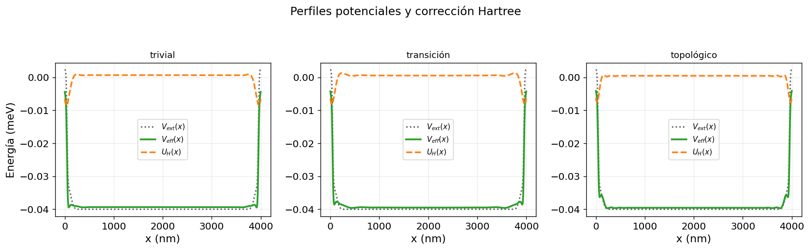

**Figure 2.3:** Potentials in the trivial, transition and topological regimes. The dotted curve is $V_{\mathrm{ext}}(x)$, the dashed curve is the Hartree correction $U_H(x)$ and the continuous curve is $V_{\mathrm{eff}}(x)=V_{\mathrm{ext}}(x)+U_H(x)$.

#### What is calculated and why

The external profile combines the global offset, the superconducting-region shift and smooth end barriers. The self-consistent Hartree correction is calculated from the spatial charge redistribution through a screened kernel. Their sum is the potential that enters the Hamiltonian. Displaying all three curves shows both the imposed device landscape and the size of the electrostatic feedback.

The comparison across regimes tests whether changing the Zeeman field reorganizes the density sufficiently to modify the longitudinal potential, particularly near the boundaries where low-energy states can accumulate.

#### Result and interpretation

The effective potential is dominated by the external profile, but it contains small self-consistent deformations through $U_H(x)$. In the trivial regime, the correction is smooth because the density is nearly homogeneous in the proximitized region and changes appreciably mainly near the ends, where confinement and the transition to normal segments act.

As $\Gamma$ increases, the reduction of the energy gap reorganizes the low-energy BdG states and transfers part of their weight toward the boundaries. Since the Hartree term is generated from spatial density variations through a screened kernel, this edge accumulation creates a more structured response. Consequently, the topological panel displays sharper changes near the ends. Within the model, these changes arise from self-consistent electrostatic response rather than from an externally imposed asymmetry.

### 2.4 Self-consistent density

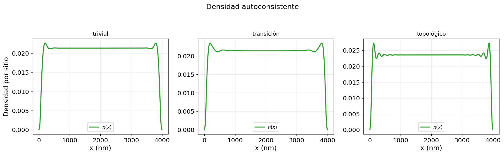

**Figure 2.4:** Self-consistent density in the trivial, transition and topological regimes.

#### What is calculated and why

The density is reconstructed from the eigenstates used in the electrostatic calculation. Its spatial profile explains the Hartree modulation: a uniform density produces little nonuniform Hartree response after mean-charge neutralization, whereas edge oscillations feed directly into $U_H(x)$.

The three panels are compared using identical geometry. The relevant question is not simply whether the total density changes, but where the redistribution occurs as the low-energy gap is reduced and reopened.

#### Result and interpretation

In the trivial regime, the density rises to an almost flat central plateau and oscillations remain confined mainly to the boundaries. This indicates that no low-energy state is strongly reorganizing the interior of the wire. Near the transition, the plateau begins to deform slightly, consistent with the closing gap and the increased sensitivity of states close to zero.

In the topological regime, the boundary oscillations are more pronounced and the first density maximum is larger. This indicates stronger accumulation of BdG weight near the ends. The resulting nonuniformity explains the more visible Hartree modulations in the preceding figure: a less uniform $n(x)$ generates a less flat $U_H(x)$ and therefore a more structured $V_{\mathrm{eff}}(x)$.

# Chapter 3

## Homogeneous bulk bands

### 3.1 Complete effective-band spectrum

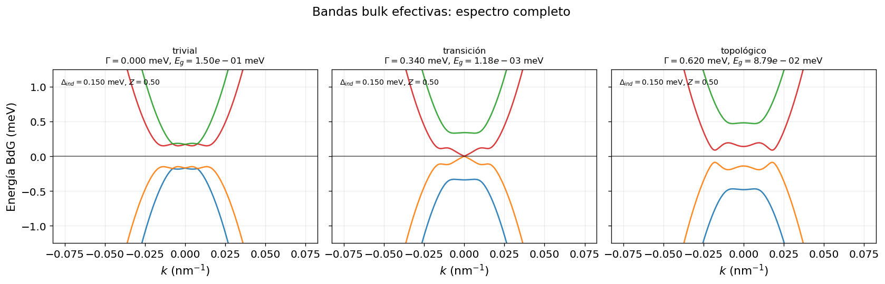

**Figure 3.1:** Effective homogeneous bulk bands in the trivial, transition and topological regimes.

#### What is calculated and why

Spatial profiles are replaced by averages over the covered region and the homogeneous lattice Hamiltonian $H_{\mathrm{bulk}}(k)$ is diagonalized over a dense momentum grid. This removes boundaries and isolates the bulk mechanism. The purpose is to verify the defining sequence of a topological transition: an open gap, a closure near a critical parameter and a reopened gap on the other side.

The four displayed branches are the two positive BdG bands and their particle–hole partners. Symmetry about $E=0$ is expected for every $k$.

#### Result and interpretation

In the trivial panel, the inner branches remain separated from zero, so the homogeneous system is gapped. At the transition, the inner branches meet close to $k=0$. After the field is increased further, the gap reopens while the band ordering has changed, identifying the non-trivial sector of the class-D model.

The full-energy view also shows that the transition is a low-energy reorganization rather than a collapse of the entire spectrum. The outer branches remain far from zero, whereas the topology is controlled by the inner pair near the Fermi level.

### 3.2 Continuous and discrete bulk spectra

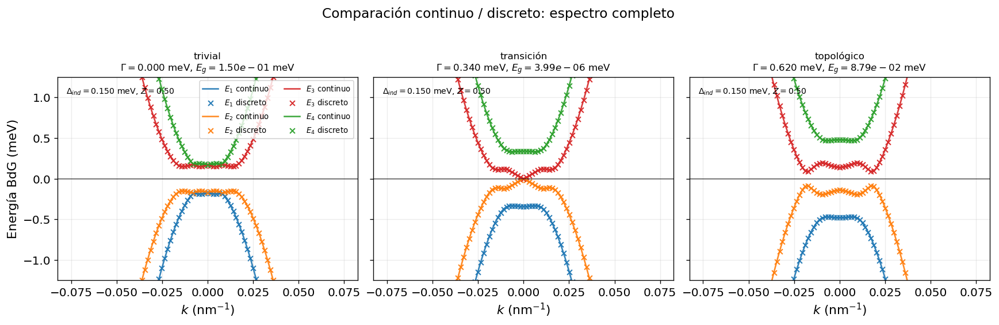

**Figure 3.2:** Comparison of the continuous evaluation of the homogeneous lattice Hamiltonian with values sampled at the discrete momenta of the spatial mesh.

#### What is calculated and why

The continuous curves evaluate $H_{\mathrm{bulk}}(k)$ on a dense momentum grid. Crosses evaluate the same Hamiltonian only at momenta compatible with the finite spatial discretization. The comparison checks that the discrete mesh captures the same subgap band structure used in the theoretical argument.

The figure also tests the finite-difference representation: the kinetic $1-\cos(ka)$ and Rashba $\sin(ka)$ dispersions should reproduce the low-momentum continuum behaviour while remaining internally consistent with the real-space hopping blocks.

#### Result and interpretation

The discrete points lie on the continuous branches in all three regimes. Near the critical field, both representations show the inner bands approaching zero at small momentum. In the topological regime they display the same reopened gap and the same particle–hole-symmetric branch structure.

This agreement supports the use of the lattice Hamiltonian for the finite wire. It indicates that the transition visible in the finite-difference model is not a plotting artefact produced by incompatible continuum and discrete formulas.

### 3.3 Subgap zoom

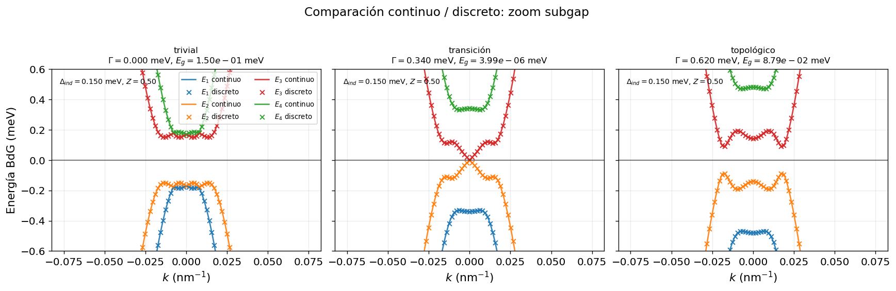

**Figure 3.3:** Subgap zoom of the continuous/discrete bulk comparison.

#### What is calculated and why

The same bulk information is displayed in a narrower energy window. The zoom is necessary because the critical gap is much smaller than the full bandwidth, and a full-scale figure can visually hide the exact closing and reopening.

#### Result and interpretation

The trivial gap is clearly finite, the transition panel reaches essentially zero near $k=0$, and the topological panel shows a nonzero reopened gap. The discrete points continue to follow the continuous curves in the region most relevant for Majorana physics.

The reopened topological gap is the energy scale that protects the boundary modes from bulk quasiparticles in the effective model. Its presence is therefore essential before interpreting a finite-wire zero mode as a topological edge state.

# Chapter 4

## Finite spectrum across parameter space

### 4.1 Zeeman sweep

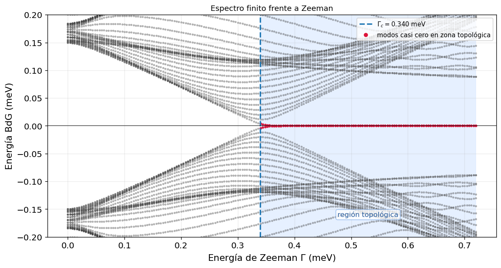

**Figure 4.1:** Low-energy finite-wire spectrum as a function of Zeeman energy. The dashed line marks the homogeneous critical estimate and the shaded region is the expected topological interval.

#### What is calculated and why

For every Zeeman value, the open finite-chain Hamiltonian is diagonalized near zero. Grey points represent the low-energy eigenvalues and red points highlight the two states nearest zero inside the predicted topological region. The calculation tests whether a persistent near-zero branch appears after the bulk transition.

A finite wire is expected to have a residual splitting

$$
E=\pm\varepsilon_M,\qquad \varepsilon_M\sim A e^{-L/\xi}\cos\left(k_F L+\phi\right).
$$

**(4.1)**

so exact zero is not required at every parameter value. The physically relevant feature is a low-energy pair that remains separated from the excited spectrum over a finite interval.

#### Result and interpretation

In the trivial region, the low-energy levels remain separated from zero. As the field approaches the transition, the finite-size gap narrows and the inner levels move toward $E=0$. Beyond the critical estimate, a nearly flat branch appears close to zero and persists across a broad field interval.

A small deviation at the beginning of the shaded region is expected. The dashed boundary comes from an approximate homogeneous model, while the actual calculation includes finite length, smooth profiles, normal ends and a nonuniform potential. Residual overlap between the two edge components also produces an oscillatory splitting. The robust observation is not a mathematically exact zero but the sustained low-energy branch after the transition.

### 4.2 Zeeman-sweep zoom

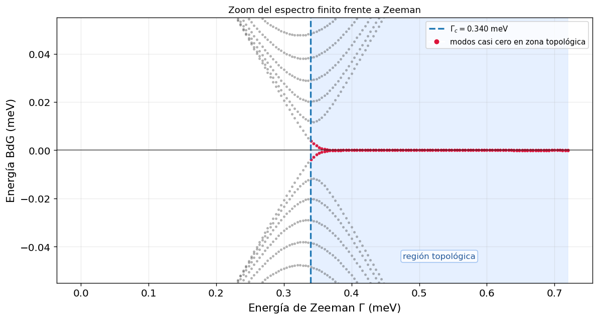

**Figure 4.2:** Zoom of the finite spectrum near zero energy as the Zeeman field crosses the transition.

#### What is calculated and why

The zoom removes higher subgap levels and focuses on the energy scale of the lowest pair. It is used to distinguish a persistent near-zero branch from a sequence of ordinary crossings that only appear close to zero because of the full plot's vertical compression.

#### Result and interpretation

The levels approach zero around the critical field and then remain pinned within a very narrow energy window through the topological region. The red markers form a continuous branch rather than an isolated point.

This persistence is one of the strongest spectral distinctions between the candidate mode and an accidental trivial crossing. It still does not identify spatial localization, which is why the LDOS and wavefunction figures remain necessary.

### 4.3 Chemical-potential sweep

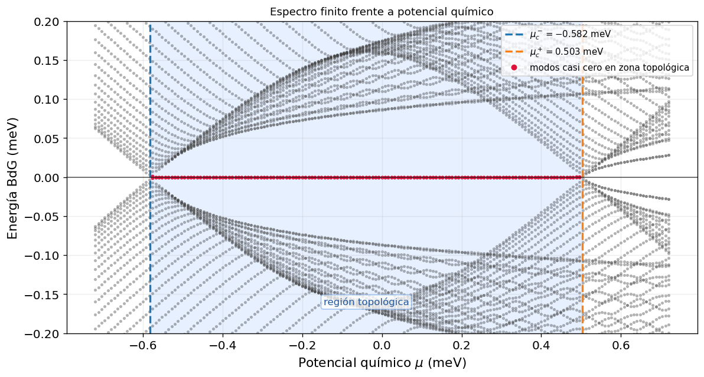

**Figure 4.3:** Low-energy finite spectrum as a function of chemical potential at fixed topological Zeeman field. Dashed lines delimit the estimated topological window.

#### What is calculated and why

The Zeeman field is held in the topological regime while the chemical potential is swept. The homogeneous criterion predicts a finite interval $\mu_c^{-}\lt\mu\lt\mu_c^{+}$. The purpose is to check whether the near-zero signal is tied to this interval rather than to one specially tuned value of $\mu$.

#### Result and interpretation

Outside the shaded window, the levels separate from zero. Inside it, a near-zero pair persists over a wide chemical-potential interval. The spectrum remains symmetric about zero, as required by BdG particle–hole symmetry.

An accidental trivial state may cross zero at one value of $\mu$, but it is not generally expected to remain pinned across the whole interval where the bulk criterion predicts a topological phase. The broad persistence therefore strengthens the topological interpretation.

### 4.4 Chemical-potential-sweep zoom

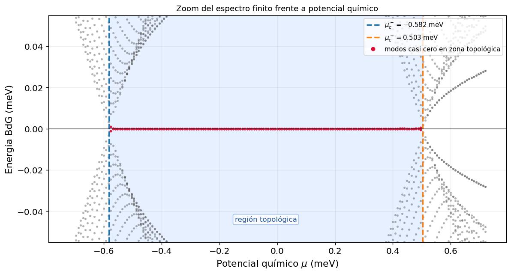

**Figure 4.4:** Zoom of the near-zero spectrum across the chemical-potential window.

#### What is calculated and why

The zoom isolates the low-energy branch and the two critical chemical potentials. It tests whether the highlighted states remain close to zero throughout the interior of the predicted window and move away only near its boundaries.

#### Result and interpretation

The red branch stays essentially at zero through most of the shaded interval and connects continuously to finite-energy states near the boundaries. The two sides are not perfectly identical because the finite, inhomogeneous model does not possess an exact symmetry under $\mu\to-\mu$ once the effective potential is included.

The important feature is the confinement of the nearly zero-energy response to the topological window. This provides a second parameter-space test independent of the Zeeman sweep.

# Chapter 5

## Local density of states

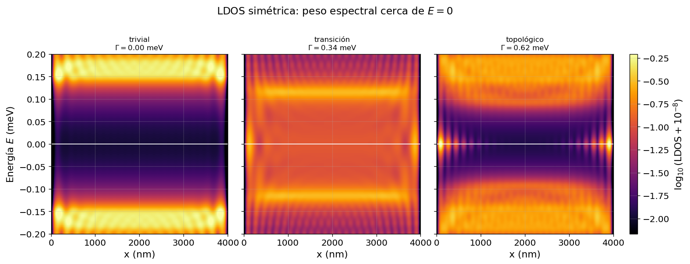

**Figure 5.1:** Symmetric position- and energy-resolved BdG spectral density near zero for the three regimes.

#### What is calculated and why

The finite spectra identify energies but contain no spatial information. The plotted map therefore combines position and energy through a Lorentzian-broadened BdG spectral weight,

$$
\rho(x_i,E)=\sum_{E_n\gt0}\rho_n(x_i)\left[\mathcal{L}_{\eta}(E-E_n)+\mathcal{L}_{\eta}(E+E_n)\right].
$$

**(5.1)**

The horizontal axis is the position along the wire, the vertical axis is energy, and colour gives the logarithm of the local spectral weight. The explicit $\pm E_n$ contributions impose the particle–hole-symmetric presentation.

This observable connects the global spectrum with a local tunnelling-like diagnostic. A Majorana end mode should produce low-energy weight near the boundaries while the central bulk remains gapped.

#### Result and interpretation

In the trivial regime, the region around $E=0$ is dark and strong weight appears only at finite energies, consistent with an open gap and no zero-energy boundary state. At the transition, spectral weight approaches zero and is more extended, as expected for a critical state associated with the closing bulk gap.

In the topological regime, intense weight appears near $E\simeq0$ simultaneously at both ends while the interior remains much darker. The vertical symmetry is the BdG particle–hole symmetry, and the approximate left–right symmetry follows from the symmetric coverage and barriers. This double end localization is the spatial pattern expected from a finite pair of Majorana boundary modes.

# Chapter 6

## Near-zero wavefunctions and internal BdG structure

### 6.1 Majorana-like left/right decomposition

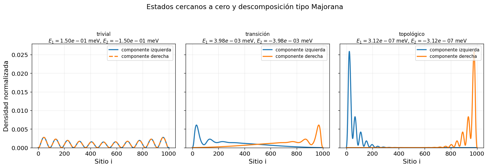

**Figure 6.1:** Decomposition of the near-zero BdG subspace into components maximally localized toward the left and right halves of the nanowire.

#### What is calculated and why

The two states nearest zero span a nearly degenerate subspace. Within that subspace, linear combinations are chosen to maximize weight on opposite halves of the wire. In the ideal particle–hole construction these combinations correspond to

$$
\Phi_L=\frac{\Phi_E+\mathcal{C}\Phi_E}{\sqrt{2}},\qquad
\Phi_R=\frac{-i\left(\Phi_E-\mathcal{C}\Phi_E\right)}{\sqrt{2}}.
$$

**(6.1)**

The purpose is to determine whether the low-energy fermionic state consists of two spatially separated components or one ordinary localized Andreev state.

#### Result and interpretation

In the trivial regime, the two combinations are not a clean nonlocal pair at opposite boundaries; their weight is distributed through the chain. At the transition, the state becomes more sensitive to the ends, but the two components still have substantial overlap and extended tails.

In the topological regime, the separation is clear: one component is concentrated at the left end and the other at the right end, with very little weight across most of the central region. Oscillations near the boundaries do not imply delocalization. Rashba coupling, finite chemical potential and smooth confinement naturally modulate the exponentially decaying envelope. The relevant observation is the strong end-to-bulk contrast and the opposite localization of the two components.

### 6.2 Electron and hole content

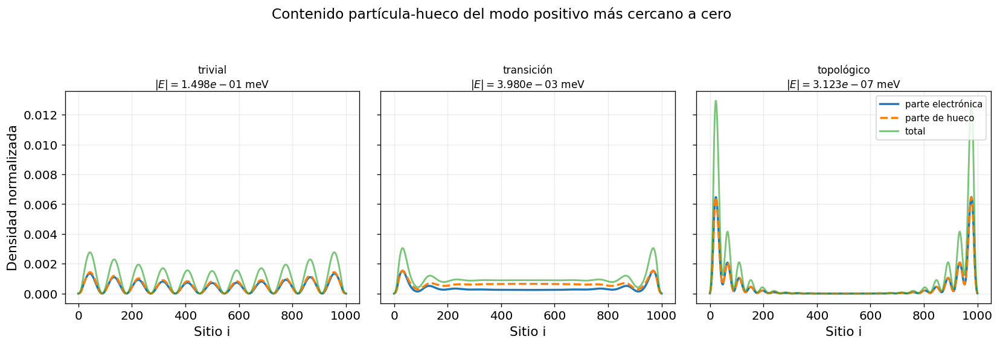

**Figure 6.2:** Electron density, hole density and total density of the positive BdG state closest to zero in the three regimes.

#### What is calculated and why

For the positive state closest to zero, the first two Nambu components define

$$
\rho_e(i)=\left|u_{n\uparrow}(i)\right|^2+\left|u_{n\downarrow}(i)\right|^2,
$$

**(6.2)**

and the hole components define

$$
\rho_h(i)=\left|v_{n\uparrow}(i)\right|^2+\left|v_{n\downarrow}(i)\right|^2.
$$

**(6.3)**

Their sum is the total normalized state density. A Majorana excitation is not purely electronic or purely hole-like; particle–hole symmetry relates the two sectors, and an ideal zero mode has balanced electron and hole content.

#### Result and interpretation

In the topological panel, electron and hole densities have almost the same spatial profile and overlap at both ends. This is consistent with an approximately self-conjugate BdG excitation. The total density is strongly boundary localized, agreeing with the Majorana decomposition and the LDOS.

The trivial and transition panels may show oscillations or some edge weight, but they do not simultaneously combine near-zero energy, nonlocal left/right separation and balanced particle–hole structure. The electron–hole result therefore reinforces the full diagnosis rather than serving as an isolated proof.

# Chapter 7

## Integrated conclusion

The complete sequence of results is internally coherent with the appearance of Majorana boundary modes in the effective model. The homogeneous bands display a gap closing and reopening as $\Gamma$ increases, indicating a change of the bulk topological sector. The finite spectrum develops a persistent near-zero branch after the transition and within the predicted chemical-potential window. The local spectral map shows that this weight is concentrated at both ends while the interior remains gapped. Finally, the near-zero subspace separates into left and right components and the corresponding BdG state has nearly balanced electron and hole content.

No single figure establishes the conclusion alone. A finite inhomogeneous wire can host trivial subgap states, and smooth confinement can generate near-zero Andreev levels. The Majorana-compatible interpretation is supported by the global agreement between bulk topology, finite-spectrum persistence, end localization, nonlocal component separation and particle–hole balance.

> **Final statement**
>
> Within the effective one-dimensional proximitized-InSb model studied here, the archived numerical results identify a robust parameter regime whose low-energy states have the expected spectral and spatial signatures of a finite pair of Majorana boundary modes. The conclusion is a statement about the internal physics of the model, not a claim that one isolated zero-energy feature would constitute definitive experimental proof.

# Bibliography

1. P. G. de Gennes, *Superconductivity of Metals and Alloys*, W. A. Benjamin (1966).
2. A. Y. Kitaev, “Unpaired Majorana fermions in quantum wires,” *Physics-Uspekhi* **44**, 131–136 (2001).
3. R. M. Lutchyn, J. D. Sau and S. Das Sarma, “Majorana Fermions and a Topological Phase Transition in Semiconductor–Superconductor Heterostructures,” *Physical Review Letters* **105**, 077001 (2010).
4. Y. Oreg, G. Refael and F. von Oppen, “Helical Liquids and Majorana Bound States in Quantum Wires,” *Physical Review Letters* **105**, 177002 (2010).
5. T. D. Stanescu, R. M. Lutchyn and S. Das Sarma, “Majorana Fermions in Semiconductor Nanowires,” *Physical Review B* **84**, 144522 (2011).
6. J. Alicea, “New directions in the pursuit of Majorana fermions in solid state systems,” *Reports on Progress in Physics* **75**, 076501 (2012).
7. G. Kells, D. Meidan and P. W. Brouwer, “Near-zero-energy end states in topologically trivial spin-orbit coupled superconducting nanowires with a smooth confinement,” *Physical Review B* **86**, 100503(R) (2012).
8. V. Mourik *et al.*, “Signatures of Majorana fermions in hybrid superconductor–semiconductor nanowire devices,” *Science* **336**, 1003–1007 (2012).
9. M. T. Deng *et al.*, “Anomalous zero-bias conductance peak in a Nb–InSb nanowire–Nb hybrid device,” *Nano Letters* **12**, 6414–6419 (2012).
10. T. D. Stanescu and S. Tewari, “Majorana fermions in semiconductor nanowires: fundamentals, modeling, and experiment,” *Journal of Physics: Condensed Matter* **25**, 233201 (2013).
11. C. W. J. Beenakker, “Search for Majorana fermions in superconductors,” *Annual Review of Condensed Matter Physics* **4**, 113–136 (2013).
12. I. van Weperen *et al.*, “Spin-orbit interaction in InSb nanowires,” *Physical Review B* **91**, 201413 (2015).
13. J.-X. Zhu, *Bogoliubov-de Gennes Method and Its Applications*, Lecture Notes in Physics 924, Springer (2016).
14. F. Domínguez *et al.*, “Zero-energy pinning from interactions in Majorana nanowires,” *npj Quantum Materials* **2**, 13 (2017).
15. A. Altland and M. R. Zirnbauer, “Nonstandard symmetry classes in mesoscopic normal-superconducting hybrid structures,” *Physical Review B* **55**, 1142–1161 (1997).
