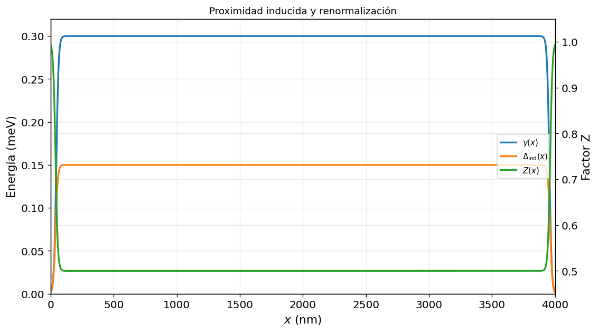
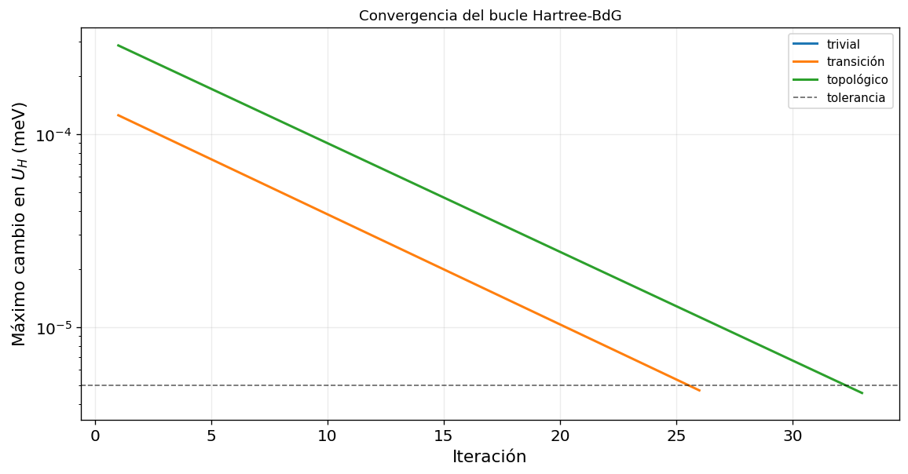

# Realistic Semiconductor–Superconductor Nanowire

*From the BdG formalism to the topological Rashba–Zeeman model*

> This document is the final theoretical section of the repository documentation. It assumes the second-quantized formalism, fermionic algebra, Nambu doubling and the elementary Majorana construction developed in the Kitaev-chain section, and the general BdG derivation developed in the self-consistent-superconductor section. Those foundations are not repeated. The objective here is to carry them into a realistic effective model for a proximitized InSb nanowire.

Technical study document in English  
Source implementation: `nanohilosimetricofinal.py`

## Contents

1. Scope and logical starting point
   1. What has already been established
   2. Why this model is more realistic than the Kitaev chain
2. Physical platform: a proximitized semiconductor nanowire
   1. Device concept
   2. Meaning of superconducting proximity
   3. Single-subband approximation
3. Nambu basis and matrix structure
   1. Choice of basis
   2. Two independent Pauli algebras
   3. Rule for deciding the Nambu matrix
4. Derivation of the continuum nanowire Hamiltonian
   1. Kinetic energy, chemical potential and longitudinal electrostatics
   2. Rashba spin–orbit coupling
   3. Zeeman coupling
   4. Induced singlet pairing
   5. Complete continuum Hamiltonian
5. Homogeneous model in momentum space
   1. Translation-invariant limit
   2. Bulk spectrum
6. Symmetries and topological classification
   1. Particle–hole symmetry
   2. Physical time reversal and Kramers degeneracy
   3. Chiral symmetry in the ideal real model
   4. Altland–Zirnbauer class D
   5. Topological criterion
   6. Expected numerical signatures before looking at the figures
7. How the realistic model modifies the homogeneous criterion
8. Summary of the theoretical chain

# Scope and logical starting point

## What has already been established

The Kitaev-chain section established the operator language of second quantization and the relation between a complex fermionic degree of freedom and two Majorana operators. The preceding self-consistent BdG section established how a superconducting mean-field Hamiltonian is written in Nambu space, why electron and hole amplitudes must be treated together, how particle–hole redundancy arises, and how a quasiparticle eigenvalue problem is obtained.

The present section starts from those results. It does not repeat the canonical anticommutation relations, the construction of Fock space, or the general mean-field decoupling. Instead, it asks a more specific question: how can the ideal topological physics of the Kitaev chain be implemented in a semiconductor device whose ingredients can be controlled experimentally?

> **Central objective**
>
> We construct a one-dimensional effective Hamiltonian for a semiconductor nanowire coupled to a conventional superconductor, include Rashba spin–orbit coupling, a longitudinal Zeeman field, an induced superconducting gap and a smooth electrostatic environment, and identify the symmetry class and the condition under which the bulk changes from a trivial to a topological phase.

## Why this model is more realistic than the Kitaev chain

The Kitaev chain is an ideal spinless lattice model with nearest-neighbour hopping and effective $p$-wave pairing. Real semiconductor nanowires contain spinful electrons and are not intrinsically $p$-wave superconductors. The realistic route is therefore indirect. Spin–orbit coupling and Zeeman splitting reorganize the spinful normal-state bands into a low-energy helical sector. Conventional $s$-wave pairing, transferred from a nearby superconductor, then projects onto this helical sector and behaves effectively as odd-parity pairing. The result can reproduce the topological structure of the Kitaev chain without requiring a fundamental spinless $p$-wave material.

# Physical platform: a proximitized semiconductor nanowire

## Device concept

**Figure 2.1:** Semiconductor–superconductor nanowire device used as the physical reference for the effective model. A central region of the InSb wire is covered by a conventional superconductor, the ends remain approximately normal, electrostatic gates control the longitudinal potential, and a magnetic field is applied along the wire. The image is reproduced unchanged from the supplied TFG material.

Once the Bogoliubov–de Gennes formalism has been developed for a generic superconductor, it can be applied to the system that serves as the central thread of this work: a one-dimensional semiconductor nanowire in contact with a conventional superconductor. This system is especially relevant because it converts an initially idealized idea, the topological Kitaev chain, into a controllable experimental platform.

The nanowire supplies a one-dimensional electronic channel, spin–orbit coupling and a strong magnetic response; the superconductor induces pairing through the proximity effect; and the Zeeman field breaks the spin degeneracy. The combination of these ingredients allows a conventional $s$-wave superconductor, which is not topological by itself, to generate an effective regime in the semiconductor that can support Majorana end modes.

The proposal was formulated for semiconductor–superconductor nanowires by Lutchyn, Sau and Das Sarma and independently by Oreg, Refael and von Oppen [3, 4]. Hybrid InSb devices subsequently displayed low-energy signatures that motivated extensive experimental and theoretical work [8, 9]. InSb and InAs are particularly useful because their small effective mass, large effective $g$ factor and appreciable spin–orbit coupling make experimentally relevant Zeeman scales accessible at moderate magnetic fields [12, 10].

## Meaning of superconducting proximity

The semiconductor is not assumed to become an autonomous bulk superconductor. In a conventional superconductor, electrons close to the Fermi level form a coherent condensate of Cooper pairs. For $s$-wave pairing, the orbital wavefunction is even and the spin state is an antisymmetric singlet. The superconducting state is therefore characterized by a macroscopic pair amplitude and by a spectral gap separating the condensate from quasiparticle excitations [1].

When the semiconductor is placed in contact with the superconductor, the electronic states of the two materials hybridize. An electron can tunnel into the superconductor and return, and two semiconductor electrons can exchange amplitude coherently with the condensate. Even if the semiconductor has no intrinsic attractive interaction strong enough to generate superconductivity, its low-energy Green function acquires anomalous electron–hole correlations. In an effective Hamiltonian these correlations are represented by an induced pairing amplitude $\Delta_{\mathrm{ind}}$.

The parent superconductor is not treated microscopically in the final model. Its influence is summarized by an induced gap, a coupling-dependent quasiparticle-weight renormalization and spatial profiles that switch the proximity effect on under the superconducting coverage and off near the normal ends. This reduction is valid only as a low-energy effective description: it retains the degrees of freedom relevant for subgap physics while integrating out the high-energy dynamics of the parent material [5].

## Single-subband approximation

Transverse confinement quantizes the nanowire into subbands. The model keeps one longitudinal subband and assumes that the separation to the next transverse mode is larger than the low-energy scales $\mu$, $\Gamma$ and $\Delta_{\mathrm{ind}}$. The retained degree of freedom is therefore a spinful one-dimensional channel whose coordinate is $x$ and whose momentum operator is

$$
p_x=-\mathrm{i}\hbar\partial_x.
$$

<strong>(2.1)</strong>

This approximation isolates the conceptual mechanism of the topological transition. A multiband device would require additional orbital indices, interband spin–orbit matrix elements and a topological criterion sensitive to the parity of occupied channels.

# Nambu basis and matrix structure

## Choice of basis

We adopt the Nambu spinor

$$
\Psi(x)= \begin{pmatrix} \psi_\uparrow(x)\\ \psi_\downarrow(x)\\ \psi_\downarrow^\dagger(x)\\ -\psi_\uparrow^\dagger(x) \end{pmatrix}.
$$

<strong>(3.1)</strong>

The first two components are electronic amplitudes and the last two are hole amplitudes. The minus sign in the fourth component is a convention that absorbs the antisymmetric spin tensor of singlet pairing. With this choice, a real local $s$-wave pair potential is represented by the simple matrix $\Delta_{\mathrm{ind}}\tau_x$ rather than by an expression carrying an explicit $\mathrm{i}\sigma_y$ factor.

This basis is physically equivalent to other common BdG conventions, but matrix expressions must never be mixed between conventions without applying the corresponding unitary basis transformation.

## Two independent Pauli algebras

The spin space is acted on by $\sigma_i$, whereas the particle–hole space is acted on by $\tau_i$:

$$
\sigma_x,\tau_x=\begin{pmatrix}0&1\\1&0\end{pmatrix},\quad \sigma_y,\tau_y=\begin{pmatrix}0&-\mathrm{i}\\\mathrm{i}&0\end{pmatrix},\quad \sigma_z,\tau_z=\begin{pmatrix}1&0\\0&-1\end{pmatrix}.
$$

<strong>(3.2)</strong>

Although the numerical $2\times2$ matrices are identical, they act on different indices. In the full four-component space, a product such as $\sigma_y\tau_z$ means a tensor product: $\sigma_y$ rotates spin while $\tau_z$ assigns opposite signs to electron and hole sectors.

## Rule for deciding the Nambu matrix

A normal-state scalar energy appears with $\tau_z$ because an electron energy $\xi$ is represented as $+\xi$ in the electron block and $-\xi$ in the hole block. A superconducting term is off-diagonal in particle–hole space and therefore appears with $\tau_x$ or $\tau_y$. Spin-dependent terms additionally carry a $\sigma_i$ matrix. The exact placement of $\tau_z$ on a spin-dependent normal term depends on the chosen Nambu convention; the basis in Eq. (3.1) fixes the expressions used below.

# Derivation of the continuum nanowire Hamiltonian

## Kinetic energy, chemical potential and longitudinal electrostatics

The normal longitudinal dispersion of an effective-mass electron is

$$
\frac{p_x^2}{2m^*}.
$$

<strong>(4.1)</strong>

The chemical potential measures energy relative to the active subband edge, while a spatially varying potential represents gates, band offsets and confinement. Define

$$
\xi(x)=\frac{p_x^2}{2m^*}-\mu+V_{\mathrm{pot}}(x).
$$

<strong>(4.2)</strong>

Because this is a normal-state energy, its BdG contribution is

$$
H_{\mathrm{normal,scalar}}=\xi(x)\tau_z.
$$

<strong>(4.3)</strong>

The $\tau_z$ matrix is not an additional physical interaction; it is the bookkeeping device that ensures the hole block is the particle–hole conjugate of the electron block.

## Rashba spin–orbit coupling

Structural inversion asymmetry creates an electric field transverse to the wire. Relativistic spin–orbit coupling then produces an effective momentum-dependent magnetic field. For a wire along $x$, axes can be chosen so that the Rashba field points along $y$. The one-dimensional term is

$$
H_R=\frac{\alpha_R}{\hbar}p_x\sigma_y.
$$

<strong>(4.4)</strong>

Since it belongs to the normal semiconductor Hamiltonian, in the adopted BdG basis it becomes

$$
H_R^{\mathrm{BdG}}=\frac{\alpha_R}{\hbar}p_x\sigma_y\tau_z.
$$

<strong>(4.5)</strong>

The three factors have distinct meanings: $p_x$ changes sign under reversal of propagation, $\sigma_y$ acts on spin, and $\tau_z$ gives the required electron–hole sign structure.

In momentum space, $p_x\to\hbar k$, so the term becomes $\alpha_R k\sigma_y\tau_z$. It splits the normal dispersion into two branches with opposite spin textures at opposite momenta. These are not exact spin eigenstates of a fixed axis once a Zeeman field is added, but they retain a helical correlation between momentum and spin.

## Zeeman coupling

For a magnetic field along the wire, chosen as the $x$ direction, the Zeeman energy is

$$
\Gamma=\frac{1}{2}g_{\mathrm{eff}}\mu_B B.
$$

<strong>(4.6)</strong>

The corresponding spin operator is $\sigma_x$. In the Nambu convention of Eq. (3.1), the BdG term is

$$
H_Z=\Gamma\sigma_x.
$$

<strong>(4.7)</strong>

No $\tau_z$ appears. The reason is not that holes are unaffected by the magnetic field. Rather, the hole basis $(\psi_\downarrow^\dagger,-\psi_\uparrow^\dagger)$ is already spin conjugated, and the unitary rearrangement used to define it transforms a real $x$-directed Zeeman term into the same $\sigma_x$ matrix in both Nambu sectors.

The Zeeman field breaks physical time-reversal symmetry and removes Kramers degeneracy. Together with Rashba coupling it produces a single effective low-energy helical channel when the chemical potential lies inside the Zeeman-induced separation near $k=0$.

## Induced singlet pairing

The induced local pair amplitude couples opposite spins at the same position. In the selected basis, a real gap is

$$
H_\Delta=\Delta_{\mathrm{ind}}(x)\tau_x.
$$

<strong>(4.8)</strong>

For a complex gap

$$
\Delta_{\mathrm{ind}}(x)=\left\lvert \Delta_{\mathrm{ind}}(x)\right\rvert\mathrm{e}^{\mathrm{i}\phi(x)},
$$

<strong>(4.9)</strong>

the corresponding matrix is

$$
H_\Delta=\operatorname{Re}\Delta_{\mathrm{ind}}(x)\tau_x- \operatorname{Im}\Delta_{\mathrm{ind}}(x)\tau_y.
$$

<strong>(4.10)</strong>

A single global superconducting phase can be removed by a gauge transformation, so the calculations use a real induced gap. Spatial phase textures or Josephson junctions would make the $\tau_y$ component physically relevant.

## Complete continuum Hamiltonian

Combining the four ingredients gives

$$
\boxed{ H_{\mathrm{BdG}}= \left(\frac{p_x^2}{2m^*}-\mu+V_{\mathrm{pot}}(x)\right)\tau_z +\frac{\alpha_R}{\hbar}p_x\sigma_y\tau_z +\Gamma\sigma_x +\Delta_{\mathrm{ind}}(x)\tau_x .}
$$

<strong>(4.11)</strong>

The first term supplies longitudinal motion and electrostatic control. The Rashba term locks spin and momentum. The Zeeman term breaks time reversal and reorganizes the low-energy spin branches. The induced pair potential mixes electrons and holes. None of these terms alone produces the desired topological superconducting phase; the phase is a collective consequence of their coexistence.

> **Connection with the Kitaev chain**
>
> After the Zeeman field leaves one helical low-energy channel, projecting local $s$-wave pairing onto that channel produces an intraband pairing amplitude that is odd in momentum. At low energy, this is the effective $p$-wave pairing of the Kitaev model. The realistic wire therefore realizes the same topological mechanism in a spinful microscopic platform.

# Homogeneous model in momentum space

## Translation-invariant limit

To classify phases, remove boundaries and spatial profiles, take $V_{\mathrm{pot}}$ constant and absorb it into $\mu$, and choose a real constant $\Delta$. Fourier transformation gives

$$
\xi_k=\frac{\hbar^2k^2}{2m^*}-\mu,
$$

<strong>(5.1)</strong>

so that

$$
H(k)=\xi_k\tau_z+\alpha_Rk\sigma_y\tau_z+\Gamma\sigma_x+\Delta\tau_x.
$$

<strong>(5.2)</strong>

This bulk Hamiltonian cannot show end states, because it has no ends. Its purpose is to identify the symmetry class, locate the bulk gap closing, and distinguish the two topological sectors.

## Bulk spectrum

Squaring the Hamiltonian, or diagonalizing its $4\times4$ matrix, gives two positive branches and their negative particle–hole partners:

$$
E_{\pm}^2(k)=\xi_k^2+\alpha_R^2k^2+\Gamma^2+\Delta^2 \pm2\sqrt{\Gamma^2(\xi_k^2+\Delta^2)+\xi_k^2\alpha_R^2k^2}.
$$

<strong>(5.3)</strong>

The full spectrum is $\{ -E_+(k),-E_-(k),E_-(k),E_+(k)\}$. Particle–hole symmetry enforces the reflection about $E=0$; it does not imply that the two positive branches are degenerate.

At $k=0$, the Rashba term vanishes and $\xi_0=-\mu$. The four eigenvalues reduce to

$$
E(0)=\pm\left(\Gamma\pm\sqrt{\mu^2+\Delta^2}\right).
$$

<strong>(5.4)</strong>

The lower branch closes when

$$
\Gamma_c=\sqrt{\mu^2+\Delta^2}.
$$

<strong>(5.5)</strong>

This closing is required because a topological invariant cannot change while the bulk remains gapped.

# Symmetries and topological classification

## Particle–hole symmetry

In the adopted basis, the antiunitary particle–hole operator is

$$
\mathcal{C}=\tau_y\sigma_yK,
$$

<strong>(6.1)</strong>

where $K$ denotes complex conjugation. Since $\tau_y\sigma_y$ is real in the combined space,

$$
\mathcal{C}^2=+1.
$$

<strong>(6.2)</strong>

The BdG constraint is

$$
\mathcal{C} H(k)\mathcal{C}^{-1}=-H(-k).
$$

<strong>(6.3)</strong>

Term by term,

$$
\begin{aligned} \mathcal{C}\tau_z\mathcal{C}^{-1}&=-\tau_z,\\ \mathcal{C}(\sigma_y\tau_z)\mathcal{C}^{-1}&=+\sigma_y\tau_z,\\ \mathcal{C}\sigma_x\mathcal{C}^{-1}&=-\sigma_x,\\ \mathcal{C}\tau_x\mathcal{C}^{-1}&=-\tau_x. \end{aligned}
$$

<strong>(6.4–6.7)</strong>

Because $\xi_{-k}=\xi_k$ and the Rashba coefficient changes sign through $k\to-k$, Eq. (6.3) follows. If

$$
H(k)\Phi_E(k)=E\Phi_E(k),
$$

<strong>(6.8)</strong>

then

$$
H(-k)\mathcal{C}\Phi_E(k)=-E\mathcal{C}\Phi_E(k).
$$

<strong>(6.9)</strong>

This is the origin of the $\pm E$ pairing seen in every spectrum plotted later.

## Physical time reversal and Kramers degeneracy

For spin-$1/2$ electrons, physical time reversal is

$$
\mathcal{T}=\mathrm{i}\sigma_yK, \qquad \mathcal{T}^2=-1.
$$

<strong>(6.10)</strong>

In the absence of a Zeeman field and for a time-reversal-invariant superconducting phase,

$$
\mathcal{T} H(k)\mathcal{T}^{-1}=H(-k).
$$

<strong>(6.11)</strong>

The Rashba term is invariant because both $k$ and spin change sign. The scalar dispersion and real singlet pairing are also invariant. The Zeeman term is odd:

$$
\mathcal{T}(\Gamma\sigma_x)\mathcal{T}^{-1}=-\Gamma\sigma_x.
$$

<strong>(6.12)</strong>

Therefore, for $\Gamma\neq0$, physical time reversal is broken.

When $\mathcal{T}^2=-1$ is a symmetry, Kramers theorem requires every state at a time-reversal-invariant momentum to have an orthogonal degenerate partner. Breaking this symmetry removes that protection. In the figures, the field therefore separates the Kramers-related branches and allows the low-energy spectrum to reorganize into an effectively nondegenerate helical channel. This removal of Kramers degeneracy is essential: an unbroken pair of time-reversed channels with ordinary $s$-wave pairing would not realize the single-channel class-D phase described here.

## Chiral symmetry in the ideal real model

When all coefficients are real and the field direction is fixed as above, the Hamiltonian anticommutes with

$$
\mathcal{S}=\sigma_y\tau_y, \qquad \{\mathcal{S},H(k)\}=0.
$$

<strong>(6.13)</strong>

This effective chiral symmetry is useful for understanding the idealized model, but it is not generally robust. A spatially non-removable superconducting phase, additional magnetic-field components, orbital effects or symmetry-breaking perturbations can destroy it. Consequently, the robust classification of the physical nanowire does not rely on this extra symmetry.

## Altland–Zirnbauer class D

For nonzero Zeeman field, the model has particle–hole symmetry with $\mathcal{C}^2=+1$, lacks physical time-reversal symmetry, and has no generic protecting chiral symmetry. It therefore belongs to class D of the Altland–Zirnbauer classification [15, 11].

In one spatial dimension, class D has a $\mathbb{Z}_2$ classification. There are only two robust sectors:

$$
\begin{aligned} \nu=0 &: \text{topologically trivial},\\ \nu=1 &: \text{topologically non-trivial}. \end{aligned}
$$

<strong>(6.14–6.15)</strong>

The invariant changes only when the bulk gap closes. Bulk–boundary correspondence then predicts one Majorana mode at each boundary between regions with different $\mathbb{Z}_2$ index.

## Topological criterion

At the transition, the $k=0$ gap vanishes, so Eq. (5.5) gives

$$
\Gamma^2=\mu^2+\Delta^2.
$$

<strong>(6.16)</strong>

Thus the homogeneous continuum model has

$$
\boxed{\Gamma<\sqrt{\mu^2+\Delta^2}\quad\text{trivial},}
$$

<strong>(6.17)</strong>

$$
\boxed{\Gamma>\sqrt{\mu^2+\Delta^2}\quad\text{topological}.}
$$

<strong>(6.18)</strong>

The equality is the bulk critical point. In a finite, inhomogeneous wire, this formula becomes a reference rather than an exact spectral boundary. Smooth potentials, normal end regions, finite length and spatially varying proximity parameters shift and broaden the observed transition.

## Expected numerical signatures before looking at the figures

The theory predicts a linked sequence of observations:

1.  The homogeneous bulk gap is open in the trivial regime.

2.  Increasing $\Gamma$ closes the gap near $k=0$.

3.  The gap reopens after the topological transition.

4.  A finite open wire develops a pair of levels close to $E=0$ in the topological interval.

5.  The near-zero spectral weight becomes concentrated near the two ends while the interior remains gapped.

6.  The low-energy fermionic state can be decomposed into two approximately self-conjugate components localized at opposite ends.

7.  Electron and hole weights become nearly balanced for the near-zero mode.

No individual item is sufficient. Smooth confinement can produce trivial Andreev bound states close to zero [7]. The numerical case is convincing only when the bulk transition, parameter-window persistence, end localization, Majorana separation and particle–hole structure agree.

# How the realistic model modifies the homogeneous criterion

The final simulation introduces three important refinements. First, the induced pair potential and normal-state energy scales vary in space. Second, integrating out the parent superconductor produces a local quasiparticle-weight factor $Z(x)$. Third, the electrostatic potential contains a self-consistent Hartree correction.

Inside the covered region, the homogeneous reference parameters are spatial averages $\overline{V}_{\mathrm{eff}}$, $\overline{\Delta}_{\mathrm{ind}}$ and $\overline{Z}$. The normal terms are multiplied by $\overline{Z}$ while the induced gap is inserted directly. At $k=0$, the approximate closing condition therefore becomes

$$
\overline{Z}\Gamma_c= \sqrt{\overline{Z}^{\,2}(\mu-\overline{V}_{\mathrm{eff}})^2+ \overline{\Delta}_{\mathrm{ind}}^{\,2}},
$$

<strong>(7.1)</strong>

which is equivalently

$$
\boxed{ \Gamma_c= \sqrt{(\mu-\overline{V}_{\mathrm{eff}})^2+ \left(\frac{\overline{\Delta}_{\mathrm{ind}}}{\overline{Z}}\right)^2}.}
$$

<strong>(7.2)</strong>

This is the critical estimate used to guide the numerical figures. It is not substituted for the finite-wire calculation; it provides the bulk reference against which the finite spectrum is interpreted.

# Summary of the theoretical chain

> **From device ingredients to Majorana boundary modes**
>
> A semiconductor nanowire supplies a controllable one-dimensional spinful band. Rashba coupling creates a momentum-dependent spin texture. A longitudinal Zeeman field breaks Kramers degeneracy and can isolate one helical low-energy channel. Proximity to a conventional superconductor induces electron–hole pairing. When the Zeeman scale exceeds the renormalized combination of chemical-potential detuning and induced gap, the homogeneous bulk closes and reopens in class D. An open finite wire can then support one Majorana component at each end, with an exponentially small finite-size hybridization.

# References

1. P. G. de Gennes, *Superconductivity of Metals and Alloys*, W. A. Benjamin (1966).
2. A. Y. Kitaev, “Unpaired Majorana fermions in quantum wires,” *Physics-Uspekhi* **44**, 131–136 (2001).
3. R. M. Lutchyn, J. D. Sau and S. Das Sarma, “Majorana Fermions and a Topological Phase Transition in Semiconductor–Superconductor Heterostructures,” *Physical Review Letters* **105**, 077001 (2010).
4. Y. Oreg, G. Refael and F. von Oppen, “Helical Liquids and Majorana Bound States in Quantum Wires,” *Physical Review Letters* **105**, 177002 (2010).
5. T. D. Stanescu, R. M. Lutchyn and S. Das Sarma, “Majorana Fermions in Semiconductor Nanowires,” *Physical Review B* **84**, 144522 (2011).
6. J. Alicea, “New directions in the pursuit of Majorana fermions in solid state systems,” *Reports on Progress in Physics* **75**, 076501 (2012).
7. G. Kells, D. Meidan and P. W. Brouwer, “Near-zero-energy end states in topologically trivial spin-orbit coupled superconducting nanowires with a smooth confinement,” *Physical Review B* **86**, 100503(R) (2012).
8. V. Mourik *et al.*, “Signatures of Majorana fermions in hybrid superconductor–semiconductor nanowire devices,” *Science* **336**, 1003–1007 (2012).
9. M. T. Deng *et al.*, “Anomalous zero-bias conductance peak in a Nb–InSb nanowire–Nb hybrid device,” *Nano Letters* **12**, 6414–6419 (2012).
10. T. D. Stanescu and S. Tewari, “Majorana fermions in semiconductor nanowires: fundamentals, modeling, and experiment,” *Journal of Physics: Condensed Matter* **25**, 233201 (2013).
11. C. W. J. Beenakker, “Search for Majorana fermions in superconductors,” *Annual Review of Condensed Matter Physics* **4**, 113–136 (2013).
12. I. van Weperen *et al.*, “Spin-orbit interaction in InSb nanowires,” *Physical Review B* **91**, 201413 (2015).
13. J.-X. Zhu, *Bogoliubov-de Gennes Method and Its Applications*, Lecture Notes in Physics 924, Springer (2016).
14. F. Domínguez *et al.*, “Zero-energy pinning from interactions in Majorana nanowires,” *npj Quantum Materials* **2**, 13 (2017).
15. A. Altland and M. R. Zirnbauer, “Nonstandard symmetry classes in mesoscopic normal-superconducting hybrid structures,” *Physical Review B* **55**, 1142–1161 (1997).

---

# Realistic Nanowire Model

*Proximity profiles, Hartree self-consistency, finite differences and simulation parameters*

> This volume starts from the continuum BdG Hamiltonian derived in the preceding theory document and develops the exact effective model used for the archived TFG simulation: spatial superconducting coverage, induced pairing, quasiparticle-weight renormalization, smooth electrostatics, screened Hartree response, real-space discretization and the homogeneous lattice Hamiltonian.

Technical appendix in English

## Contents

1. Numerical objective and model hierarchy
2. Effective finite-wire Hamiltonian
3. Spatial proximity profiles
   1. Smooth superconducting coverage
   2. Local interface coupling
   3. Induced pairing and quasiparticle-weight factor
4. External electrostatic potential
5. Hartree electrostatic self-consistency
   1. Effective potential
   2. Screened interaction kernel
   3. BdG density used in the TFG formulation
   4. Iterative closure
6. Finite-difference discretization
   1. Spatial mesh and Nambu vector
   2. Second derivative
   3. First derivative and Rashba hopping
   4. On-site block
   5. Nearest-neighbour block
   6. Block-tridiagonal matrix and open boundaries
7. Homogeneous lattice Hamiltonian in momentum space
   1. Constant blocks
   2. Bloch substitution
8. Numerical workflow
9. Reference physical and numerical parameters
   1. Material and proximity parameters
   2. Hartree, mesh and diagnostic parameters
10. Observables derived from the converged eigenproblem
    1. Finite spectrum
    2. Symmetric BdG spectral density
    3. Electron and hole content
    4. Majorana combinations
11. Interpretive limits

# Numerical objective and model hierarchy

Once the nanowire BdG model and its topological criterion have been established, the numerical task is to study a finite system in real space with open boundaries and determine whether the effective Hamiltonian produces subgap states compatible with Majorana end modes.

The calculation is not a microscopic simulation of the complete three-dimensional heterostructure. It is an effective, realistic and controllable one-dimensional model of an InSb nanowire proximitized by a conventional superconductor. It contains Rashba coupling, Zeeman splitting, induced superconductivity, low-energy renormalization due to the parent superconductor, a smooth longitudinal potential and a self-consistent Hartree correction.

The model is organized into three levels:

1.  A continuum BdG operator defines the physical terms.

2.  Spatial profiles specify where the wire is covered and how electrostatic and proximity parameters vary.

3.  A finite-difference lattice converts the differential operator into a block-tridiagonal Hermitian matrix that can be diagonalized.

# Effective finite-wire Hamiltonian

The Hamiltonian implemented for the finite proximitized wire is

$$
\boxed{ H_{\mathrm{BdG}}=Z(x)\left[ \left(\frac{p_x^2}{2m^*}-\mu+V_{\mathrm{eff}}(x)\right)\tau_z +\frac{\alpha_R}{\hbar}p_x\sigma_y\tau_z +\Gamma\sigma_x \right]+\Delta_{\mathrm{ind}}(x)\tau_x .}
$$

<strong>(2.1)</strong>

The factor $Z(x)$ multiplies the normal semiconductor scales. In the low-energy self-energy description, a quasiparticle partly resides in the parent superconductor, so its semiconductor spectral weight is reduced. The kinetic energy, chemical-potential detuning, electrostatic potential, Rashba coupling and Zeeman energy are renormalized accordingly. The induced pairing $\Delta_{\mathrm{ind}}(x)$ is inserted directly as the effective anomalous amplitude.

The semiconductor is not assigned an intrinsic self-consistent order parameter. Unlike the preceding generic self-consistent-superconductor model, $\Delta_{\mathrm{ind}}(x)$ is not updated from an anomalous expectation value. Instead, the parent superconductor is integrated out and represented by $\Delta_{\mathrm{ind}}(x)$ and $Z(x)$. The self-consistency in this final model applies to the electrostatic Hartree potential.

# Spatial proximity profiles

## Smooth superconducting coverage

A finite central region is covered by the parent superconductor while short normal segments remain at the two ends. The coverage is represented by

$$
f_{\mathrm{SC}}(x)=\frac{1}{2}\left[ \tanh\left(\frac{x-x_L}{s_{\mathrm{SC}}}\right) -\tanh\left(\frac{x-x_R}{s_{\mathrm{SC}}}\right) \right],\qquad x_R=L-x_L.
$$

<strong>(3.1)</strong>

The first hyperbolic tangent switches the coverage on near $x_L$ and the second switches it off near $x_R$. The interface length $s_{\mathrm{SC}}$ controls how abrupt the transition is. The symmetric choice $x_R=L-x_L$ prevents an externally imposed left–right asymmetry from being mistaken for a property of the low-energy state.

## Local interface coupling

The semiconductor–superconductor coupling is

$$
\gamma(x)=\gamma_0 f_{\mathrm{SC}}(x).
$$

<strong>(3.2)</strong>

It approaches $\gamma_0$ beneath the covered region and vanishes at the normal ends.

## Induced pairing and quasiparticle-weight factor

The effective low-energy expressions are

$$
\Delta_{\mathrm{ind}}(x)=\frac{\gamma(x)\Delta_0}{\gamma(x)+\Delta_0}, \qquad Z(x)=\left(1+\frac{\gamma(x)}{\Delta_0}\right)^{-1}.
$$

<strong>(3.3)</strong>

Here $\Delta_0$ is the parent gap. Both functions are controlled by the same interface coupling. In the weak-coupling limit $\gamma\ll\Delta_0$, one has $\Delta_{\mathrm{ind}}\approx\gamma$ and $Z\approx1$. In the strong-coupling limit, the induced gap approaches the parent scale while the semiconductor quasiparticle weight is significantly reduced.

For the reference values $\gamma_0=\Delta_0=0.30\,\mathrm{meV}$, the covered region has approximately

$$
\Delta_{\mathrm{ind}}\simeq0.15\,\mathrm{meV},\qquad Z\simeq0.5.
$$

<strong>(3.4)</strong>

*Original proximity profiles used in the TFG simulation. The coverage controls $\gamma(x)$, the induced gap and $Z(x)$. The central region is proximitized; both ends revert smoothly toward normal-semiconductor behaviour.*

# External electrostatic potential

The smooth longitudinal profile is

$$
\begin{aligned} V_{\mathrm{ext}}(x)={}&E_0+V_g+V_{\mathrm{SC}}^{(0)}f_{\mathrm{SC}}(x)\\ &+V_b^{(0)}\exp\left[-\frac{(x-x_b)^2}{2\sigma_b^2}\right] +V_b^{(0)}\exp\left[-\frac{(x-(L-x_b))^2}{2\sigma_b^2}\right]. \end{aligned}
$$

<strong>(4.1–4.2)</strong>

Each term has a separate role:

- $E_0$ is a fixed band-offset contribution.

- $V_g$ is a uniform gate-controlled shift.

- $V_{\mathrm{SC}}^{(0)}f_{\mathrm{SC}}(x)$ models the band shift beneath the superconducting coverage.

- The two Gaussian terms model smooth barriers near the ends.

The barriers are mirrored about the centre. Their height $V_b^{(0)}$, centre $x_b$ and width $\sigma_b$ control the degree of confinement without imposing hard-wall discontinuities in the potential itself.

Smooth confinement is physically relevant and numerically delicate. It can support low-energy Andreev bound states even in a topologically trivial regime. Therefore, the presence of a near-zero eigenvalue cannot be used alone as a Majorana diagnosis; spatial separation and consistency with the bulk topological interval must also be checked [7].

# Hartree electrostatic self-consistency

## Effective potential

The potential entering the BdG Hamiltonian is

$$
V_{\mathrm{eff}}(x_i)=V_{\mathrm{ext}}(x_i)+U_H(x_i).
$$

<strong>(5.1)</strong>

The Hartree term allows the longitudinal electrostatic landscape to respond to charge redistribution. It is a controlled one-dimensional approximation to the coupled electrostatic problem, not a replacement for a full three-dimensional Schrödinger–Poisson calculation.

## Screened interaction kernel

The calculated Hartree response is

$$
U_{H,\mathrm{calc}}(x_i)=\sum_j\nu_{ij}\,\delta n_j, \qquad \nu_{ij}=U_0\exp\left(-\frac{|x_i-x_j|}{\lambda_{\mathrm{scr}}}\right).
$$

<strong>(5.2)</strong>

The parameter $U_0$ fixes the interaction scale and $\lambda_{\mathrm{scr}}$ fixes the range. The exponential kernel is symmetric and nonlocal. It captures screened electrostatic feedback while keeping the model computationally transparent.

## BdG density used in the TFG formulation

For a complete BdG spectrum, the local density is written as

$$
n^{(m)}(x_i)=\sum_{E_n>0,\sigma}\left[ |u_{n\sigma}^{(m)}(i)|^2 f(E_n^{(m)}) +|v_{n\sigma}^{(m)}(i)|^2\left(1-f(E_n^{(m)})\right) \right].
$$

<strong>(5.3)</strong>

Only positive energies are summed because the negative-energy partners contain the same physical information in the doubled Nambu representation. The Fermi function is

$$
f(E)=\frac{1}{\exp(E/k_BT)+1}.
$$

<strong>(5.4)</strong>

At zero temperature, positive-energy quasiparticles are empty and the density is determined by the hole amplitudes. At finite temperature, thermally occupied quasiparticles add electron-like weight.

A reference profile is subtracted:

$$
\delta n_i^{(m)}=n^{(m)}(x_i)-n_{\mathrm{ref}}(x_i).
$$

<strong>(5.5)</strong>

The uniform component is removed according to

$$
\delta n_i^{(m)}\longrightarrow \delta n_i^{(m)}-\left\langle\delta n^{(m)}\right\rangle.
$$

<strong>(5.6)</strong>

This makes the Hartree term respond mainly to spatial redistribution rather than acting as an uncontrolled global redefinition of the chemical potential.

## Iterative closure

At iteration $m$,

$$
V_{\mathrm{eff}}^{(m)}(x_i)=V_{\mathrm{ext}}(x_i)+U_H^{(m)}(x_i),
$$

<strong>(5.7)</strong>

then

$$
H_{\mathrm{BdG}}^{(m)}\Phi_n^{(m)}=E_n^{(m)}\Phi_n^{(m)}.
$$

<strong>(5.8)</strong>

The new density produces $U_{H,\mathrm{calc}}^{(m)}$, and the potential is updated by linear mixing:

$$
U_H^{(m+1)}(x_i)= (1-\eta_{\mathrm{mix}})U_H^{(m)}(x_i) +\eta_{\mathrm{mix}}U_{H,\mathrm{calc}}^{(m)}(x_i).
$$

<strong>(5.9)</strong>

The iteration stops when

$$
\max_i\left\lvert U_H^{(m+1)}(x_i)-U_H^{(m)}(x_i)\right\rvert<\epsilon.
$$

<strong>(5.10)</strong>

Mixing damps oscillatory or overcorrecting fixed-point behaviour. A small $\eta_{\mathrm{mix}}$ improves stability but increases the number of iterations.

*Original convergence history. The maximum change of the Hartree potential decreases approximately exponentially until it reaches the numerical tolerance.*

# Finite-difference discretization

## Spatial mesh and Nambu vector

The interval is replaced by

$$
x_i=ia,\qquad i=0,\ldots,N-1,\qquad a=\frac{L}{N-1}.
$$

<strong>(6.1)</strong>

At each site,

$$
\Phi_i= \begin{pmatrix} u_{\uparrow,i}\\u_{\downarrow,i}\\v_{\downarrow,i}\\-v_{\uparrow,i}\end{pmatrix},
$$

<strong>(6.2)</strong>

where the first symbol is understood as $u_{\uparrow,i}$; the full vector is

$$
\Phi=\begin{pmatrix}\Phi_0\\\Phi_1\\\vdots\\\Phi_{N-1}\end{pmatrix}.
$$

<strong>(6.3)</strong>

Each site contributes four degrees of freedom, so the matrix dimension is $4N\times4N$. For $L=4000\,\mathrm{nm}$ and $N=1001$, one has $a=4\,\mathrm{nm}$ and a $4004\times4004$ BdG matrix.

## Second derivative

The centred approximation is

$$
\partial_x^2\Phi(x_i)\simeq \frac{\Phi_{i+1}-2\Phi_i+\Phi_{i-1}}{a^2}.
$$

<strong>(6.4)</strong>

Since $p_x^2=-\hbar^2\partial_x^2$, the kinetic term becomes

$$
-\frac{\hbar^2}{2m^*}\partial_x^2\Phi_i \simeq 2t\Phi_i-t\Phi_{i+1}-t\Phi_{i-1},
$$

<strong>(6.5)</strong>

with

$$
t=\frac{\hbar^2}{2m^*a^2}.
$$

<strong>(6.6)</strong>

The on-site contribution is $2t$ and each nearest-neighbour kinetic hopping is $-t$.

## First derivative and Rashba hopping

The centred first derivative is

$$
\partial_x\Phi(x_i)\simeq\frac{\Phi_{i+1}-\Phi_{i-1}}{2a}.
$$

<strong>(6.7)</strong>

Using $p_x=-\mathrm{i}\hbar\partial_x$,

$$
\frac{\alpha_R}{\hbar}p_x\sigma_y\tau_z =-\mathrm{i}\alpha_R\partial_x\sigma_y\tau_z.
$$

<strong>(6.8)</strong>

Therefore the right-neighbour contribution is proportional to $-\mathrm{i} t_{\mathrm{SO}}\sigma_y\tau_z$ and the left-neighbour contribution is its Hermitian conjugate, where

$$
t_{\mathrm{SO}}=\frac{\alpha_R}{2a}.
$$

<strong>(6.9)</strong>

## On-site block

The local $4\times4$ block is

$$
H_{ii}=Z_i(2t-\mu+V_{\mathrm{eff},i})\tau_z +Z_i\Gamma\sigma_x +\operatorname{Re}\Delta_i\tau_x -\operatorname{Im}\Delta_i\tau_y,
$$

<strong>(6.10)</strong>

with $Z_i=Z(x_i)$ and $\Delta_i=\Delta_{\mathrm{ind}}(x_i)$. The $2t$ term is the local piece generated by the discrete Laplacian.

## Nearest-neighbour block

A symmetric bond renormalization is chosen as

$$
Z_{i+1/2}=\sqrt{Z_iZ_{i+1}}.
$$

<strong>(6.11)</strong>

The right-neighbour block is

$$
H_{i,i+1}=Z_{i+1/2}\left(-t\tau_z-\mathrm{i} t_{\mathrm{SO}}\sigma_y\tau_z\right),
$$

<strong>(6.12)</strong>

and

$$
H_{i+1,i}=H_{i,i+1}^\dagger =Z_{i+1/2}\left(-t\tau_z+\mathrm{i} t_{\mathrm{SO}}\sigma_y\tau_z\right).
$$

<strong>(6.13)</strong>

The geometric mean treats both ends of a bond symmetrically and guarantees that the two off-diagonal blocks are Hermitian conjugates.

## Block-tridiagonal matrix and open boundaries

The full matrix is

$$
H_{\mathrm{BdG}}^{\mathrm{disc}}= \begin{pmatrix} H_{00}&H_{01}&0&\cdots&0\\ H_{10}&H_{11}&H_{12}&\cdots&0\\ 0&H_{21}&H_{22}&\ddots&\vdots\\ \vdots&\ddots&\ddots&\ddots&H_{N-2,N-1}\\ 0&0&\cdots&H_{N-1,N-2}&H_{N-1,N-1} \end{pmatrix}.
$$

<strong>(6.14)</strong>

There is no bond from site $N-1$ back to site $0$. These open boundary conditions are required to study end-localized states. Periodic boundaries would eliminate physical ends and would be suitable only for a bulk band calculation.

# Homogeneous lattice Hamiltonian in momentum space

## Constant blocks

Replace spatial profiles by their averages inside the covered region:

$$
Z_i\to\bar Z,\qquad V_{\mathrm{eff},i}\to\bar V_{\mathrm{eff}},\qquad \Delta_i\to\bar\Delta_{\mathrm{ind}}.
$$

<strong>(7.1)</strong>

The constant local and hopping blocks are

$$
H_0=\bar Z(2t-\mu+\bar V_{\mathrm{eff}})\tau_z +\bar Z\Gamma\sigma_x+\bar\Delta_{\mathrm{ind}}\tau_x,
$$

<strong>(7.2)</strong>

$$
T=\bar Z(-t\tau_z-\mathrm{i} t_{\mathrm{SO}}\sigma_y\tau_z),\qquad T^\dagger=\bar Z(-t\tau_z+\mathrm{i} t_{\mathrm{SO}}\sigma_y\tau_z).
$$

<strong>(7.3)</strong>

## Bloch substitution

For a translation-invariant chain,

$$
\Phi_i=\mathrm{e}^{\mathrm{i} kx_i}\Phi_k,\qquad x_i=ia.
$$

<strong>(7.4)</strong>

The momentum-space block is

$$
H_{\mathrm{bulk}}(k)=H_0+T\mathrm{e}^{\mathrm{i} ka}+T^\dagger\mathrm{e}^{-\mathrm{i} ka}.
$$

<strong>(7.5)</strong>

The kinetic terms combine as

$$
2t-t(\mathrm{e}^{\mathrm{i} ka}+\mathrm{e}^{-\mathrm{i} ka})=2t[1-\cos(ka)],
$$

<strong>(7.6)</strong>

and the Rashba terms combine as

$$
-\mathrm{i} t_{\mathrm{SO}}(\mathrm{e}^{\mathrm{i} ka}-\mathrm{e}^{-\mathrm{i} ka})=2t_{\mathrm{SO}}\sin(ka).
$$

<strong>(7.7)</strong>

Therefore

$$
\boxed{ H_{\mathrm{bulk}}(k)=\bar Z\left[ \left(2t[1-\cos(ka)]-\mu+\bar V_{\mathrm{eff}}\right)\tau_z +2t_{\mathrm{SO}}\sin(ka)\sigma_y\tau_z +\Gamma\sigma_x \right]+\bar\Delta_{\mathrm{ind}}\tau_x.}
$$

<strong>(7.8)</strong>

For $ka\ll1$,

$$
2t[1-\cos(ka)]\simeq t(ka)^2=\frac{\hbar^2k^2}{2m^*},
$$

<strong>(7.9)</strong>

and

$$
2t_{\mathrm{SO}}\sin(ka)\simeq\alpha_Rk,
$$

<strong>(7.10)</strong>

so the continuum Hamiltonian is recovered.

# Numerical workflow

The complete TFG workflow is:

1.  Choose physical and numerical parameters.

2.  Construct $x_i$, $a$, $t$ and $t_{\mathrm{SO}}$.

3.  Evaluate $f_{\mathrm{SC}}(x_i)$, $\gamma(x_i)$, $\Delta_{\mathrm{ind}}(x_i)$ and $Z(x_i)$.

4.  Construct $V_{\mathrm{ext}}(x_i)$ and the screened interaction matrix $\nu_{ij}$.

5.  Initialize $U_H^{(0)}(x_i)$.

6.  Build $V_{\mathrm{eff}}^{(m)}$ and the BdG matrix.

7.  Diagonalize, calculate the density and update $U_H$ by mixing.

8.  Repeat until Eq. (5.10) is satisfied.

9.  Rebuild the final Hamiltonian from the converged potential.

10. Use sparse shift-invert diagonalization when only eigenstates near zero are required.

11. Calculate the bulk bands, finite spectra, LDOS, particle–hole content and localized Majorana combinations.

# Reference physical and numerical parameters

## Material and proximity parameters

| **Parameter**           | **Reference value**         | **Meaning**                                                              |
|:------------------------|:----------------------------|:-------------------------------------------------------------------------|
| $m^*/m_e$               | $0.014$                     | Effective InSb mass entering the kinetic energy.                         |
| $g_{\mathrm{eff}}$      | $40$                        | Effective gyromagnetic factor relating magnetic field and Zeeman energy. |
| $\mu_B$                 | $0.0578838\,\mathrm{meV/T}$ | Bohr magneton in the simulation units.                                   |
| $\Gamma$                | $g_{\mathrm{eff}}\mu_BB/2$  | Longitudinal Zeeman energy; the code works directly in meV.              |
| $\alpha_R$              | $25\,\mathrm{meV\,nm}$      | Rashba spin–orbit coupling.                                              |
| $\mu$                   | $0.12\,\mathrm{meV}$        | Effective chemical potential of the active subband.                      |
| $T$                     | $0.02\,\mathrm{K}$          | Temperature used in the Fermi occupation.                                |
| $\Delta_0$              | $0.30\,\mathrm{meV}$        | Parent-superconductor gap.                                               |
| $\gamma_0$              | $0.30\,\mathrm{meV}$        | Maximum semiconductor–superconductor coupling.                           |
| $x_L$                   | $45\,\mathrm{nm}$           | Left normal–proximitized interface.                                      |
| $x_R$                   | $L-x_L$                     | Right interface, chosen symmetrically.                                   |
| $s_{\mathrm{SC}}$       | $18\,\mathrm{nm}$           | Interface smoothing length.                                              |
| $E_0$                   | $0\,\mathrm{meV}$           | Fixed longitudinal offset.                                               |
| $V_g$                   | $0\,\mathrm{meV}$           | Uniform gate contribution.                                               |
| $V_{\mathrm{SC}}^{(0)}$ | $-0.04\,\mathrm{meV}$       | Potential shift beneath the superconductor.                              |
| $V_b^{(0)}$             | $0.006\,\mathrm{meV}$       | Height of the smooth end barriers.                                       |
| $x_b$                   | $75\,\mathrm{nm}$           | Centre of the left Gaussian barrier.                                     |
| $\sigma_b$              | $55\,\mathrm{nm}$           | Gaussian barrier width.                                                  |

## Hartree, mesh and diagnostic parameters

| **Parameter**              | **Reference value**                              | **Meaning**                                            |
|:---------------------------|:-------------------------------------------------|:-------------------------------------------------------|
| $U_0$                      | $0.035\,\mathrm{meV}$                            | Strength of the effective screened interaction kernel. |
| $\lambda_{\mathrm{scr}}$   | $45\,\mathrm{nm}$                                | Hartree screening length.                              |
| $\eta_{\mathrm{mix}}$      | $0.12$                                           | Linear-mixing parameter.                               |
| $\epsilon_{\mathrm{tol}}$  | $5\times10^{-6}\,\mathrm{meV}$                   | Hartree convergence tolerance.                         |
| $N_{\mathrm{iter}}^{\max}$ | $60$                                             | Maximum number of Hartree iterations.                  |
| $L$                        | $4000\,\mathrm{nm}$                              | Total wire length.                                     |
| $N$                        | $1001$                                           | Number of sites used for the final TFG figures.        |
| $a$                        | $4\,\mathrm{nm}$                                 | Grid spacing $L/(N-1)$.                                |
| Matrix size                | $4004\times4004$                                 | Four Nambu–spin components per site.                   |
| Boundary conditions        | Open                                             | The last site is not connected to the first.           |
| $\Gamma_{\mathrm{triv}}$   | $0\,\mathrm{meV}$                                | Representative trivial regime.                         |
| $\Gamma_c$                 | $\simeq0.34\,\mathrm{meV}$                       | Critical estimate from covered-region averages.        |
| $\Gamma_{\mathrm{top}}$    | $0.62\,\mathrm{meV}$                             | Representative topological regime.                     |
| Zeeman sweep               | $0\leq\Gamma\leq0.72\,\mathrm{meV}$, 271 points  | Finite-spectrum transition sweep.                      |
| Chemical-potential sweep   | $-0.72\leq\mu\leq0.72\,\mathrm{meV}$, 271 points | Topological-window sweep.                              |
| $N_k$                      | $700$                                            | Momentum points in the homogeneous bands.              |
| $k_{\max}$                 | $0.075\,\mathrm{nm^{-1}}$                        | Displayed momentum range.                              |
| $N_E$                      | $500$                                            | Energy points in the LDOS.                             |
| LDOS window                | $[-0.20,0.20]$ meV                               | Subgap energy interval.                                |
| $\eta_{\mathrm{LDOS}}$     | $0.012\,\mathrm{meV}$                            | Lorentzian broadening.                                 |
| Near-zero threshold        | $0.010\,\mathrm{meV}$                            | Visual criterion for highlighting low-energy levels.   |

# Observables derived from the converged eigenproblem

## Finite spectrum

The eigenvalues closest to zero are followed as functions of $\Gamma$ and $\mu$. Particle–hole symmetry requires paired values $\pm E_n$. A persistent near-zero pair inside the predicted topological interval is more significant than a single accidental zero crossing.

## Symmetric BdG spectral density

The plotted position–energy map is

$$
\rho(x_i,E)=\sum_{E_n>0}\rho_n(x_i) \left[\mathcal{L}_\eta(E-E_n)+\mathcal{L}_\eta(E+E_n)\right],
$$

<strong>(10.1)</strong>

where

$$
\rho_n(x_i)=\left\lvert \Phi_n(i)\right\rvert^2, \qquad \mathcal{L}_\eta(E)=\frac{\eta}{\pi(E^2+\eta^2)}.
$$

<strong>(10.2)</strong>

The explicit $\pm E_n$ terms make the BdG particle–hole symmetry visible in the map.

## Electron and hole content

For the positive state nearest zero,

$$
\rho_e(i)=\left\lvert u_{n\uparrow}(i)\right\rvert^2+\left\lvert u_{n\downarrow}(i)\right\rvert^2,
$$

<strong>(10.3)</strong>

$$
\rho_h(i)=\left\lvert v_{n\uparrow}(i)\right\rvert^2+\left\lvert v_{n\downarrow}(i)\right\rvert^2,
$$

<strong>(10.4)</strong>

and $\rho_{\mathrm{tot}}=\rho_e+\rho_h$. A self-conjugate zero mode has matching electron and hole structure, up to the unitary transformation imposed by the Nambu convention.

## Majorana combinations

Given a near-zero state $\Phi_E$ and its particle–hole partner,

$$
\Phi_L=\frac{\Phi_E+\mathcal{C}\Phi_E}{\sqrt{2}},\qquad \Phi_R=\frac{-\mathrm{i}(\Phi_E-\mathcal{C}\Phi_E)}{\sqrt{2}}.
$$

<strong>(10.5)</strong>

In finite-precision calculations, an equivalent and stable procedure is to diagonalize a left-half position projector inside the two-dimensional near-zero subspace. The resulting linear combinations maximize localization on opposite halves of the wire.

# Interpretive limits

The effective model is richer than the Kitaev chain but remains a reduced description. It neglects explicit transverse orbitals, disorder in the parent material, orbital magnetic effects, a microscopic superconducting self-energy with full frequency dependence and three-dimensional electrostatics. The Hartree kernel is phenomenological, and the critical formula is a homogeneous estimate. These limitations do not invalidate the internal numerical diagnostics; they define the level at which the conclusions should be stated: the results identify a robust Majorana-compatible regime within the specified effective model.

# References

1. P. G. de Gennes, *Superconductivity of Metals and Alloys*, W. A. Benjamin (1966).
2. A. Y. Kitaev, “Unpaired Majorana fermions in quantum wires,” *Physics-Uspekhi* **44**, 131–136 (2001).
3. R. M. Lutchyn, J. D. Sau and S. Das Sarma, “Majorana Fermions and a Topological Phase Transition in Semiconductor–Superconductor Heterostructures,” *Physical Review Letters* **105**, 077001 (2010).
4. Y. Oreg, G. Refael and F. von Oppen, “Helical Liquids and Majorana Bound States in Quantum Wires,” *Physical Review Letters* **105**, 177002 (2010).
5. T. D. Stanescu, R. M. Lutchyn and S. Das Sarma, “Majorana Fermions in Semiconductor Nanowires,” *Physical Review B* **84**, 144522 (2011).
6. J. Alicea, “New directions in the pursuit of Majorana fermions in solid state systems,” *Reports on Progress in Physics* **75**, 076501 (2012).
7. G. Kells, D. Meidan and P. W. Brouwer, “Near-zero-energy end states in topologically trivial spin-orbit coupled superconducting nanowires with a smooth confinement,” *Physical Review B* **86**, 100503(R) (2012).
8. V. Mourik *et al.*, “Signatures of Majorana fermions in hybrid superconductor–semiconductor nanowire devices,” *Science* **336**, 1003–1007 (2012).
9. M. T. Deng *et al.*, “Anomalous zero-bias conductance peak in a Nb–InSb nanowire–Nb hybrid device,” *Nano Letters* **12**, 6414–6419 (2012).
10. T. D. Stanescu and S. Tewari, “Majorana fermions in semiconductor nanowires: fundamentals, modeling, and experiment,” *Journal of Physics: Condensed Matter* **25**, 233201 (2013).
11. C. W. J. Beenakker, “Search for Majorana fermions in superconductors,” *Annual Review of Condensed Matter Physics* **4**, 113–136 (2013).
12. I. van Weperen *et al.*, “Spin-orbit interaction in InSb nanowires,” *Physical Review B* **91**, 201413 (2015).
13. J.-X. Zhu, *Bogoliubov-de Gennes Method and Its Applications*, Lecture Notes in Physics 924, Springer (2016).
14. F. Domínguez *et al.*, “Zero-energy pinning from interactions in Majorana nanowires,” *npj Quantum Materials* **2**, 13 (2017).
15. A. Altland and M. R. Zirnbauer, “Nonstandard symmetry classes in mesoscopic normal-superconducting hybrid structures,” *Physical Review B* **55**, 1142–1161 (1997).
